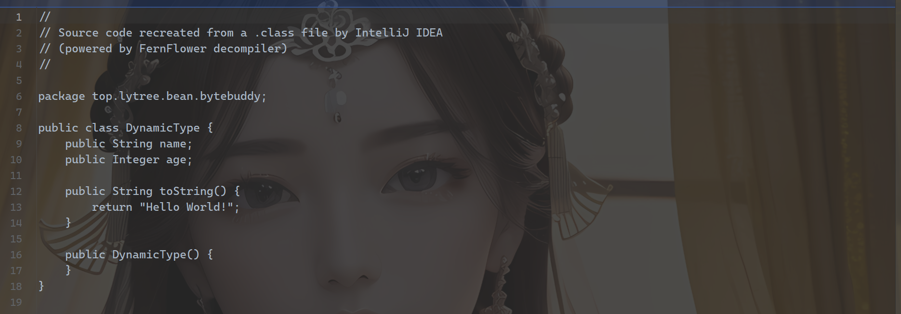

# ByteBuddy

```
      <dependency>
            <groupId>net.bytebuddy</groupId>
            <artifactId>byte-buddy</artifactId>
            <version>1.11.12</version>
        </dependency>
```

## Hello World

```
Class<?> dynamicType = new ByteBuddy()
                .subclass(Object.class)
                .method(ElementMatchers.named("toString"))
                .intercept(FixedValue.value("Hello World"))
                .make()
                .load(HelloWorldBuddy.class.getClassLoader())
                .getLoaded();
Object instance = dynamicType.newInstance();
String toString = instance.toString();
System.out.println(toString);
System.out.println(instance.getClass().getCanonicalName());
```

​​

　　从例子可以看出，很简单就创建了一个动态类型。ByteBuddy提供了一套流式API，从ByteBuddy实例出发，可以流畅的完成所有的操作和数据定义。  
上面的示例中

* subclass 指定了新创建的类的父类
* method 指定了 Object 的 toString 方法
* intercept 拦截了 toString 方法并返回固定的 value
* 最后 make 方法生产字节码，有类加载器加载到虚拟机中

　　此外，Byte Buddy不仅限于创建子类和操作类，还可以转换现有代码。Byte Buddy 还提供了一个方便的 API，用于定义所谓的 Java 代理，该代理允许在任何 Java 应用程序的运行期间进行代码转换

## 创建动态类

```
DynamicType.Unloaded<?> dynamicType = new ByteBuddy()
  .subclass(Object.class)
  .name("com.zlk.learning.bytebuddy.DynamicType")
  .make();
```

　　上面的示例代码会创建一个继承至 Object 类型的类。这个动态创建的类型与直接扩展 Object 并且没有实现任何方法、属性和构造函数的类型是等价的，如下：

```
public class DynamicTYpe {

}
```

　　在创建类的时候，还提供了更多API来支持对类的定义，包括定义字段、方法等

```
        DynamicType.Unloaded<?> dynamicType = new ByteBuddy()
                .subclass(Object.class)
                .name("com.zlk.learning.bytebuddy.DynamicType")
                .defineField("name", String.class, 1)
                .defineField("age", Integer.class, 1)
                .method(ElementMatchers.named("toString"))
                .intercept(FixedValue.value("Hello World!"))
                .make();
```

​​

　　上面的示例代码中，我们增加了两个字段name和age，同时拦截了toString方法，使其输出固定值 “Hello World!”。

　　保留父类实现的接口信息

```java


    @Override
    public Object instantiate(BeanDefinition beanDefinition, String beanName, Constructor ctor, Object[] args) throws BeansException {
        Class<?> beanClass = beanDefinition.getBeanClass();
        ArrayList<TypeDescription.Generic> list = getGenerics(beanClass);
        Class clazz = new ByteBuddy().subclass(beanClass).implement(list)
                .make()
                .load(getClass().getClassLoader())
                .getLoaded();
        try {
            if (null == ctor) return clazz.getDeclaredConstructor().newInstance();
            return clazz.getDeclaredConstructor(ctor.getParameterTypes()).newInstance(args);
        } catch (NoSuchMethodException | InstantiationException | IllegalAccessException | InvocationTargetException e) {
            throw new BeansException("Failed to instantiate [" + clazz.getName() + "]", e);
        }
    }
    //获取父类的接口信息
    private static ArrayList<TypeDescription.Generic> getGenerics(Class<?> beanClass) {
        ArrayList<TypeDescription.Generic> list = new ArrayList<>();
        try {
            Type[] genericInterfaces = beanClass.getGenericInterfaces();
            for (Type type : genericInterfaces) {
                Type[] typeArguments = ((ParameterizedType) type).getActualTypeArguments();
                Class<?>[] classes = new Class[typeArguments.length];
                for (int i = 0; i < typeArguments.length; i++) {
                    classes[i] = Class.forName(typeArguments[i].getTypeName());
                }
                Class<?> aClass = Class.forName(((ParameterizedType) type).getRawType().getTypeName());
                TypeDescription.Generic listType = TypeDescription.Generic.Builder.parameterizedType(aClass, classes).build();
                list.add(listType);
            }
        } catch (ClassNotFoundException e) {
            throw new BeansException("Failed to instantiate [" + beanClass.getName() + "]", e);
        }
        return list;
    }
```

　　‍

## 加载类

　　上节创建的 DynamicType.Unloaded，代表一个尚未加载的类，顾名思义，这些类型不会加载到 Java 虚拟机中，它仅仅表示创建好了类的字节码，通过 DynamicType.Unloaded 中的 getBytes 方法你可以获取到该字节码。

　　在应用程序中，可能需要将该字节码保存到文件，或者注入的现在的 jar 文件中，因此该类型还提供了一个 saveIn(File) 方法，可以将类存储在给定的文件夹中； inject(File) 方法将类注入到现有的 Jar 文件中，另外你只需要将该字节码直接加载到虚拟机使用，你可以通过 ClassLoadingStrategy 来加载。

　　如果不指定ClassLoadingStrategy，Byte Buffer根据你提供的ClassLoader来推导出一个策略，内置的策略定义在枚举ClassLoadingStrategy.Default中

* WRAPPER：创建一个新的Wrapping类加载器
* CHILD_FIRST：类似上面，但是子加载器优先负责加载目标类
* INJECTION：利用反射机制注入动态类型

```
 Class<?> dynamicClass = dynamicType
                .load(Object.class.getClassLoader(), ClassLoadingStrategy.Default.WRAPPER)
                .getLoaded();
```

　　我们使用 WRAPPER 策略来加载适合大多数情况的类，这样生产的动态类不会被ApplicationClassLoader加载到，不会影响到项目中已经存在的类  
​`getLoaded 方法返回一个 Java Class 的实例，它就表示现在加载的动态类`​

## 拦截方法

　　在之前的例子中，我们拦截了toString方法，并使其输出固定值。不过在实际开发中很少会遇到如此简单的场景，我们可以通过指定拦截方法的形式来处理复杂的逻辑

### 通过匹配模式拦截

　　ByteBuddy 通过 net.bytebuddy.matcher.ElementMatcher 来定义配置策略，可以通过此接口实现自己定义的匹配策略

```
Foo dynamicFoo = new ByteBuddy()
  .subclass(Foo.class)
  // 匹配由Foo.class声明的方法
  .method(isDeclaredBy(Foo.class)).intercept(FixedValue.value("One!"))
  // 匹配名为foo的方法
  .method(named("foo")).intercept(FixedValue.value("Two!"))
  // 匹配名为foo，入参数量为1的方法
  .method(named("foo").and(takesArguments(1))).intercept(FixedValue.value("Three!"))
  .make()
  .load(getClass().getClassLoader())
  .getLoaded()
  .newInstance();
```

### 方法委托

　　使用MethodDelegation可以将方法调用委托给任意POJO。Byte Buddy不要求Source（被委托类）、Target类的方法名一致

```
class Source {
  public String hello(String name) { return null; }
}

class Target {

  public static String hello(String name) {
    return "Hello " + name + "!";
  }
}

String helloWorld = new ByteBuddy()
  .subclass(Source.class)
  .method(named("hello"))
  // 此处委托 类只能委托静态方法  对象可使用非静态方法
  .intercept(MethodDelegation.to(Target.class))
  .make()
  .load(getClass().getClassLoader())
  .getLoaded()
  .newInstance()
  .hello("World");
```

　　其中 Target 还可以如下实现：

```
class Target {
  public static String intercept(String name) { return "Hello " + name + "!"; }
  public static String intercept(int i) { return Integer.toString(i); }
  public static String intercept(Object o) { return o.toString(); }
}
```

　　前一个实现因为只有一个方法，而且类型也匹配，很好理解，那么后一个呢，Byte Buddy到底会委托给哪个方法？Byte Buddy遵循一个最接近原则：

* intercept(int)因为参数类型不匹配，直接Pass
* 另外两个方法参数都匹配，但是 intercept(String)类型更加接近，因此会委托给它

　　同时需要注意的是被拦截的方法需要声明为 public，否则没法进行拦截增强。除此之外，还可以使用 @RuntimeType 注解来标注方法

```java
    @RuntimeType
    public  Object interceptor(@This Object proxy, @Origin Method method,
                              @SuperMethod Method superMethod,
                              @AllArguments Object[] args) throws Exception {
        System.out.println("bytebuddy delegate proxy2 before sing ");
        Object ret = superMethod.invoke(proxy, args);
        System.out.println("bytebuddy delegate proxy2 after sing ");
        return ret;
    }
```

### 参数绑定

　　可以在拦截器（Target）的拦截方法 intercept 中使用注解注入参数，ByteBuddy 会根据注解给我们注入对于的参数值。比如

```
void intercept(Object o1, Object o2)
// 等同于
void intercept(@Argument(0) Object o1, @Argument(1) Object o2)
```

　　常用注解有以下这些：

* @Argument 绑定单个参数
* @AllArguments 绑定所有参数的数组
* @This 当前被拦截的、动态生成的那个对象
* @DefaultCall 调用默认方法而非super的方法
* @SuperCall 用于调用父类版本的方法
* @Origin 被拦截的源方法
* @RuntimeType 可以用在返回值、参数上，提示ByteBuddy禁用严格的类型检查
* @Super 当前被拦截的、动态生成的那个对象的父类对象
* @FieldValue 注入被拦截对象的一个字段的值

## Agent

　　Java 从 1.5 开始提供了 java.lang.instrument包，该包为检测 Java 程序提供 API，比如用于监控、收集性能信息、诊断问题。通过 java.lang.instrument 实现工具被称为 Java Agent。Java Agent 可以修改类文件的字节码，通常是，在字节码方法插入额外的字节码来完成检测

　　和通过ByteBuddy实例创建动态类型一样，bytebuddy也提供了AgentBuilder类使我们在agent中更优雅地编写代码

```
class ToStringAgent {
  public static void premain(String arguments, Instrumentation instrumentation) {
    new AgentBuilder.Default()
        .type(isAnnotatedWith(ToString.class))
        .transform(new AgentBuilder.Transformer() {
      @Override
      public DynamicType.Builder transform(DynamicType.Builder builder,
                                              TypeDescription typeDescription,
                                              ClassLoader classloader) {
        return builder.method(named("toString"))
                      .intercept(FixedValue.value("transformed"));
      }
    }).installOn(instrumentation);
  }
}
```

* type 通过ElementMatcher 来匹配我们加载的class，匹配到之后，将会使用
* transform 指定的转换器来对匹配到的class进行操作

## ElementMatcher

　　ElementMatcher可以定义匹配class的规则，在bytebuddy中，ElementMatchers类提供了许多常规的匹配方式，可以按照class name、注解、类型等来进行匹配，上面的实例中就是使用注解匹配的方式

　　Junction继承自ElementMatcher接口，定义了and 和 or 方法，可以使我们在定义Matcher时通过链式定义一连串的匹配规则

```
      new AgentBuilder.Default()
                .type(ElementMatchers.isAnnotatedWith(ToString.class)).and(ElementMatchers.isSubTypeOf(DynamicClass.class)).or(ElementMatchers.named("DynamicClass"))
                .transform(new AgentBuilder.Transformer() {
                    public DynamicType.Builder<?> transform(DynamicType.Builder<?> builder, TypeDescription typeDescription, ClassLoader classLoader, JavaModule javaModule) {
                        return builder
                                .method(ElementMatchers.named("hello"))
                                .intercept(MethodDelegation.to(MyServiceInterceptor.class))
                                ;
                    }
                }).installOn(instrumentation);
```

## [Transformer](https://so.csdn.net/so/search?q=Transformer&spm=1001.2101.3001.7020)

　　Transformer 接口定义了 transform方法，会传入DynamicType.Builder实例，通过该builder，就可以对匹配到的类进行操作，就和上面讲的 ByteBuddy创建动态类型时类似操作，可以定义字段以及对方法进行拦截操作等，上面的例子就是对匹配到的类的hello方法进行了方法委托，在调用hello方法时，将会委托给 MyServiceInterceptor类

```
public class MyServiceInterceptor {

    @RuntimeType
    public static Object intercept(@Origin Method method, @SuperCall Callable<?> callable) throws Exception {
        System.out.println("intercept：拦截了" + method.getName());
        return callable.call();
    }
  
}

```

## 

　　‍

## END

　　**参考文章**  
​`bytebuddy官方文档 https://bytebuddy.net/#/tutorial`

　　`https://juejin.cn/post/6844903965553852423#heading-12`​​
