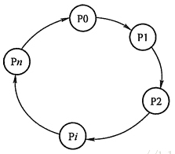

# thread

## 概述

### 并发与并行

　　并行：指两个或多个事件在同一时刻发生（同时发生）。  
并发：指两个或多个事件在同一个时间段内发生。  
​​

### 进程、线程

> 进程是正在运行的程序的实例。  
> 进程是线程的容器，即一个进程中可以开启多个线程。

> 线程是进程内部的一个独立执行单元；  
> 一个进程可以同时并发运行多个线程；

## 线程生命周期

　　​  1. 新建

* new 关键字创建了一个线程之后，该线程就处于新建状态
* JVM 为线程分配内存，初始化成员变量值

2. 就绪

    * 当线程对象调用了 start()方法之后，该线程处于就绪状态
    * JVM 为线程创建方法栈和程序计数器，等待线程调度器调度
3. 运行

    * 就绪状态的线程获得 CPU 资源，开始运行 run()方法，该线程进入运行状态
4. 阻塞

    * 线程在等待进入临界区
5. 无限期等待

    * 处于这种状态的线程不会被分配CPU执行时间，它们要等待被显式地唤醒，否则会处于无限期等待的状态。
6. 限期等待

    * 处于这种状态的线程不会被分配CPU执行时间，不过无须无限期等待被其他线程显示地唤醒，在达到一定时间后它们会自动唤醒。
7. 死亡

    * 线程会以如下 3 种方式结束，结束后就处于死亡状态：
    * run()或 call()方法执行完成，线程正常结束。
    * 线程抛出一个未捕获的 Exception 或 Error。>调用该线程 stop()方法来结束该线程，该方法容易导致死锁，不推荐使用。

## 死锁

　　多个线程因竞争资源而造成的一种僵局(互相等待)

### 死锁产生必要条件

1. 互斥条件  
    在一段时间内某资源仅为一个进程所占有。此时若有其他进程请求该资源，则请求进程只能等待
2. 不可剥夺条件  
    进程所获得的资源在未使用完毕之前，不能被其他进程强行夺走，即只能由获得该资源的进程自己来释放（只能是主动释放)。
3. 请求与保持  
    进程已经保持了至少一个资源，但又提出了新的资源请求，而该资源已被其他进程占有，此时请求进程被阻塞，但对自己已获得的资源保持不放。
4. 循环等待条件  
    存在一种进程资源的循环等待链，链中每一个进程已获得的资源同时被 链中下一个进程所请求。即存在一个处于等待状态的进程集合{Pl, P2, …, pn}，其中 Pi 等 待的资源被 P(i+1)占有（i=0, 1, …, n-1)，Pn 等待的资源被 P0 占有，如图所示

​​

### 死锁处理

### 死锁预防

1. 破坏“互斥”条件  
    ​`互斥`​条件是无法破坏的。因此，在死锁预防里主要是破坏其他几个必要条件，而不去涉及破坏`互斥`​条件。
2. 破坏“占有并等待”条件  
    系统中不允许进程在已获得某种资源的情况下，申请其他资源。即要想出一个办法，阻止进程在持有资源的同时申请其他资源

    * 方法一：一次性分配资源，即创建进程时，要求它申请所需的全部资源，系统或满足其所有要求，或什么也不给它。
    * 方法二：要求每个进程提出新的资源申请前，释放它所占有的资源。这样，一个进程在需要资源 S 时，须先把它先前占有的资源 R 释放掉，然后才能提出对 S 的申请，即使它可能很快又要用到资源 R。
3. 破坏“不可抢占”条件  
    破坏“不可抢占”条件就是允许对资源实行抢夺。

    * 方法一：如果占有某些资源的一个进程进行进一步资源请求被拒绝，则该进程必须释放它最初占有的资源，如果有必要，可再次请求这些资源和另外的资源。
    * 方法二：如果一个进程请求当前被另一个进程占有的一个资源，则操作系统可以抢占另一个进程，要求它释放资源。只有在任意两个进程的优先级都不相同的条件下，方法二才能预防死锁。
4. 破坏“循环等待”条件  
    破坏“循环等待”条件的一种方法，是将系统中的所有资源统一编号，进程可在任何时刻提出资源申请，但所有申请必须按照资源的编号顺序（升序）提出。这样做就能保证系统不出现死锁。

### 死锁避免

1. 有序资源分配法  
    算法

```
必须为所有资源统一编号，
同类资源必须一次申请完，
不同类资源必须按顺序申请
```

2. 银行家算法  
    银行家算法的基本思想是分配资源之前，判断系统是否是安全的；若是，才分配。它是最具有代表性的避免死锁的算法。  
    设进程 i 提出请求 REQUEST [i]，则银行家算法按如下规则进行判断。​

```
1. 如果REQUEST [i]<= NEED[i，j]，则转（2)；否则，出错。
2 .如果REQUEST [i]<= AVAILABLE[i]，则转（3)；否则，等待。
3 .系统试探分配资源，修改相关数据：
   AVAILABLE[i]-=REQUEST[i];//可用资源数-请求资源数
   ALLOCATION[i]+=REQUEST[i];//已分配资源数+请求资源数
   NEED[i]-=REQUEST[i];//需要资源数-请求资源数
系统执行安全性检查，如安全，则分配成立；否则试探险性分配作废，系统恢复原状，进程等待
```

3. 顺序加锁  
    如果能确保所有的线程都是按照相同的顺序获得锁，那么死锁就不会发生,但是，这种方式需要事先知道所有可能会用到的锁，但总有些时候是无法预知的，所以该种方式只适合特定场景
4. 限时加锁  
    限时加锁是线程在尝试获取锁的时候加一个超时时间，若超过这个时间则放弃对该锁请求，并回退并释放所有已经获得的锁，然后等待一段随机的时间再重试  
    这种方式有两个缺点：

```
1) 当线程数量少时，该种方式可避免死锁，但当线程数量过多，这些线程的加锁时限相同的概率就高很多，可能会导致超时后重试的死循环。
2) Java中不能对synchronized同步块设置超时时间。你需要创建一个自定义锁，或使用Java5中java.util.concurrent包下的工具
```

### 死锁检测

　　**死锁检测算法**  
​​

```
E 是现有资源向量（existing resource vector），代码每种已存在资源的总数
A 是可用资源向量（available resource vector），那么Ai表示当前可供使用的资源数（即没有被分配的资源）
C 是当前分配矩阵（current allocation matrix），C的第i行代表Pi当前所持有的每一种类型资源的资源数
R 是请求矩阵（request matrix），R的每一行代表P所需要的资源的数量
```

　　**死锁检测步骤：**

```
寻找一个没有结束标记的进程Pi，对于它而言R矩阵的第i行向量小于或等于A。
如果找到了这样一个进程，执行该进程，然后将C矩阵的第i行向量加到A中，标记该进程，并转到第1步
如果没有这样的进程，那么算法终止
算法结束时，所有没有标记过的进程都是死锁进程
```

### 死锁恢复

* 资源剥夺法  
  剥夺陷于死锁的进程所占用的资源，但并不撤销此进程，直至死锁解除。
* 进程回退法  
  根据系统保存的检查点让所有的进程回退，直到足以解除死锁，这种措施要求系统建立保存检查点、回退及重启机制。
* 进程撤销法

  * 撤销陷入死锁的所有进程，解除死锁，继续运行。
  * 逐个撤销陷入死锁的进程，回收其资源并重新分配，直至死锁解除。

## Java创建线程

* 继承 Thread 类 extends Thread
* 实现 Runnable 接口 implements Runnable
* 实现 Callable 接口 implements Callable

  * 实现 Callable 接口。 相较于实现 Runnable 接口的方式，方法可以有返回值，并且可以抛出异常。
  * 执行 Callable 方式，需要 FutureTask 实现类的支持，用于接收运算结果。 FutureTask 是 Future 接口的实现类，线程启动 `new Thread(objectFutureTask1).start()`​

> Future

* cancel()方法用来取消任务，如果取消任务成功则返回true，如果取消任务失败则返回false。

  * 参数mayInterruptIfRunning表示是否允许取消正在执行却没有执行完毕的任务，如果设置true，则表示可以取消正在执行过程中的任务。
  * 如果任务已经完成，则无论mayInterruptIfRunning为true还是false，此方法肯定返回false，即如果取消已经完成的任务会返回false
  * 如果任务正在执行，若mayInterruptIfRunning设置为true，则返回true，若mayInterruptIfRunning设置为false，则返回false；如果任务还没有执行，则无论mayInterruptIfRunning为true还是false，肯定返回true。
* isCancelled()方法表示任务是否被取消成功，如果在任务正常完成前被取消成功，则返回 true。
* isDone()方法表示任务是否已经完成，若任务完成，则返回true；
* get()方法用来获取执行结果，这个方法会产生阻塞，会一直等到任务执行完毕才返回；
* get(long timeout, TimeUnit unit)用来获取执行结果，如果在指定时间内，还没获取到结果，就直接返回null。

> FutureTask
>
> 实现了RunnableFuture接口，而RunnableFuture接口继承了Runnable与Future接口，所以它既可以作为Runnable被线程中执行，又可以作为callable获得返回值。

* 适合应用场景

  * 执行多任务计算
  * 在高并发环境下确保任务只执行一次

### 小结

* 实现接口和继承 Thread 类比较

> 接口更适合多个相同的程序代码的线程去共享同一个资源。  
> 接口可以避免 java 中的单继承的局限性。  
> 接口代码可以被多个线程共享，代码和线程独立。  
> 线程池只能放入实现 Runable 或 Callable 接口的线程，不能直接放入继承 Thread 的类。  
> 扩充：在 java 中，每次程序运行至少启动 2 个线程。一个是 main 线程，一个是垃圾收集线程。

* Runnable 和 Callable 接口比较

  * 相同点：

> 两者都是接口；  
> 两者都可用来编写多线程程序；  
> 两者都需要调用 Thread.start()启动线程；

* 不同点：

> 实现 Callable 接口的线程能返回执行结果；而实现 Runnable 接口的线程不能返回结果；  
> Callable 接口的 call()方法允许抛出异常；而 Runnable 接口的 run()方法的不允许抛异常；  
> 实现 Callable 接口的线程可以调用 Future.cancel 取消执行  ，而实现 Runnable 接口的线程不能

* 注意点：

> Callable 接口支持返回执行结果，此时需要调用 FutureTask.get()方法实现，此方法会阻塞主线程直到获取‘将来’结果；当不调用此方法时，主线程不会阻塞！
>
> 实现Runnable接口,在某些情况下可以提高性能，使用继承 Thread 类方式，每次执行一次任务，都需要新建一个独立的线程，执行完任务后线程走到生命周期的尽头被销毁，如果还想执行这个任务，就必须再新建一个继承了 Thread 类的类，如果此时执行的内容比较少，比如只是在 run() 方法里简单打印一行文字，那么它所带来的开销并不大，相比于整个线程从开始创建到执行完毕被销毁，这一系列的操作比 run() 方法打印文字本身带来的开销要大得多，相当于捡了芝麻丢了西瓜，得不偿失。如果我们使用实现 Runnable 接口的方式，就可以把任务直接传入线程池，使用一些固定的线程来完成任务，不需要每次新建销毁线程，大大降低了性能开销。
