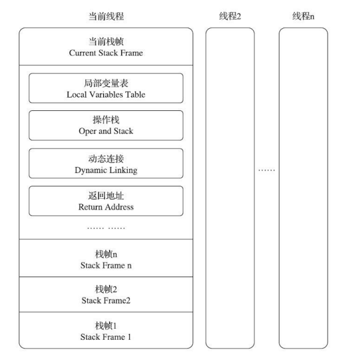
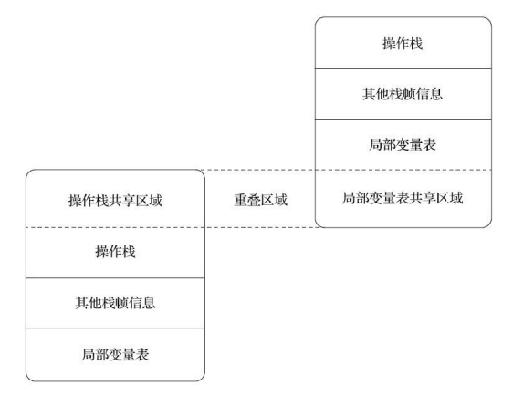

# Java虚拟机栈栈帧

　　java虚拟机以方法作为最基本的执行单位。“栈帧”是用于支持虚拟机进行方法调用和方法执行背后的数据结构。栈帧存储了方法的局部变量表，操作数栈，动态链接和方法返回地址等信息。  
​

　　***栈帧的概念结构***

## 局部变量表

- 局部变量表是一组变量值的存储空间，局部变量表以变量槽为单位
- java虚拟机规范中未规定一个变量槽应该占有内存空间大小，只是有导向的说明没个变量槽都应该存放一个boolean，byte，char，short，int，float，reference，returnAddress类型的数据

　　**reference 表示对一个对象的引用，java虚拟机规范中并没有明确指出reference类型的长度。** 
虚拟机至少通过这个应用确认两件事：

1. 根据引用直接或间接的查找到对象在java堆中的数据存放的起始地址或索引
2. 根据引用直接或间接的查找对象所属数据类型在方法区中的存储的类型信息

　　**returnAddress现在基本很少出现**

## 操作数栈

　　
 **_ 两个栈帧之间的数据共享  _**

## 动态链接

## 方法返回地址

## 附加信息
