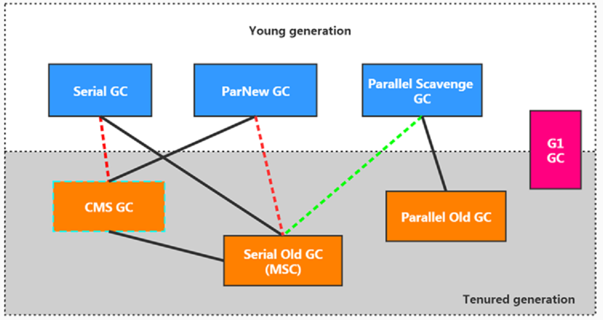
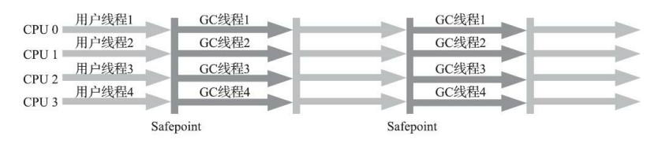
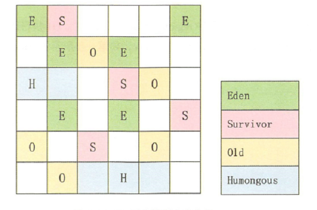

# 垃圾回收和内存分配

## 垃圾回收

### 垃圾判别算法

#### 引用计数法

> 一个对象A，只要有任何一个对象引用了A ，则A 的引用计数器就加1，当引用失效时，引用计数器就减1。只要对象A 的引用计数器的值为0，即表示对象A不可能再被使用，可进行回收。

* 优点

  * 实现简单，垃圾对象便于辨识；判定效率高，回收没有延迟性。
* 缺点

  * 需要单独的字段存储计数器，增加了存储空间的开销。
  * 每次赋值伴随着计数器的增减，增加时间开销。
  * 无法处理循环依赖的问题

#### 可达性分析 

> 将对象及其引用关系看作一个图，选定活动的对象作为 GC Roots，然后跟踪引用链条，如果一个对象和GC Roots之间不可达，也就是不存在引用链条，那么即可认为是可回收对象。

　　基本思路：

* 可达性分析算法是以根对象集合(GC Roots)为起始点，按照从上至下的方式搜索被根对象集合所连接的目标对象是否可达。
* 使用可达性分析算法后，内存中的存活对象都会被根对象集合直接或间接连接着，搜索所走过的路径称为引用链(Reference Chain)
* 如果目标对象没有任何引用链相连，则是不可达的，就意味着该对象己经死亡，可以标记为垃圾对象。
* 在可达性分析算法中，只有能够被根对象集合直接或者间接连接的对象才是存活对象。

　　可作为"GC Roots"的对象

* 虚拟机栈（栈帧中的本地变量表）中引用的对象，例如各个线程调用的方法堆中的参数，局部变量，临时变量。
* 方法区中类静态属性引用的对象，例如java 类中的引用类型的静态变量
* 方法区中常量引用的对象，例如字符串常量池中的引用
* 本地方法栈中JNI（Native方法）引用的对象
* Java虚拟机内部的引用，例如基础类型对应的Class对象，一些常驻的异常对象，还有系统类加载器
* 所有被同步锁持有的对象。
* 反应java虚拟机内部情况的JMXBean，JVMTI中的注册的回调，本地代码缓存等（？？？）

　　注：如果要使用可达性分析算法来判断内存是否可回收，那么分析工作必须在一个能保障*一致性的快照*中进行，这点也是导致GC进行时必须“Stop The World”的一个重要原因。

### 垃圾回收算法

#### 标记清除

> 标记：Collector从引用根节点开始遍历，标记所有被引用的对象。一般是在对象的Header中记录为可达对象。  
> 清除：Collector对堆内存从头到尾进行线性的遍历，如果发现某个对象在其Header中没有标记为可达对象，则将其回收。

* 效率比较低：递归与全堆对象遍历两次
* 在进行GC的时候，需要停止整个应用程序，导致用户体验差
* 这种方式清理出来的空闲内存是不连续的，产生内存碎片。

#### 标记复制

> 将活着的内存空间分为两块，每次只使用其中一块，在垃圾回收时将正在使用的内存中的存活对象复制到未被使用的内存块中，之后清除正在使用的内存块中的所有对象，交换两个内存的角色，最后完成垃圾回收。

* 优点

  * 不会造成空间碎片。
* 缺点

  * 需要两倍的内存空间
  * 对于G1这种分拆成为大量region的GC，复制而不是移动，意味着GC需要维护region之间对象引用关系，不管是内存占用或者时间开销也不小。

　　注：如果系统中的存活对象很多，复制算法不会很理想。因为复制算法需要复制的存活对象数量并不会太大,或者说非常低才行。

#### 标记整理

> 从根节点开始标记所有被引用对象  
> 将所有的存活对象压缩到内存的一端，按顺序排放，清理边界外所有的空间。

* 优点

  * 消除了标记/清除算法当中，内存区域分散的缺点，我们需要给新对象分配内存时，JVM只需要持有一个内存的起始地址即可。
  * 消除了复制算法当中，内存减半的高额代价。
* 缺点

  * 效率不高，不仅要标记所有存活对象，还要整理所有存活对象的引用地址。
  * 对于老年代每次都有大量对象存活的区域来说，极为负重。
  * 移动对象的同时，如果对象被其他对象引用，则还需要调整引用的地址。
  * 移动过程中，需要全程暂停用户应用程序。即：STW

#### 分代收集

> 基于这样一个事实：不同的对象的生命周期是不一样的。因此，不同生命周期的对象可以采取不同的收集方式，以便提高回收效率。一般是把Java堆分为新生代和老年代，这样就可以根据各个年代的特点使用不同的回收算法，以提高垃圾回收的效率。

#### 增量回收

> 垃圾收集线程只收集一小片区域的内存空间，接着切换到应用程序线程。依次反复，直到垃圾收集完成。

　　注：线程上下文切换频繁，是的垃圾回收成本上升，导致吞吐量上升

#### 分区算法

> 将按照对象的生命周期长短划分成两个部分，分区算法将整个堆空间划分成连续的不同小区间。每一个小区间都独立使用，独立回收。

### JVM四种引用

#### 强引用

　　特点：GC时，永远不会被回收  
使用场景

> new 对象

#### 软引用SoftReference<Object>(obj);

　　特点：内存不足时（自动触发GC），会被回收  
使用场景

> 缓存

#### 弱引用WeakReference<Object>(obj)

　　特点：无论内存是否充足，只要进行GC，都会被回收  
使用场景

> 内部对象为弱引用 WeakReference为强引用

#### 虚引用PhantomReference<>(new Object(),new ReferenceQueue<>())

　　特点：如同虚设，和没有引用没什么区别  
使用场景

> 1. 管理堆外面的引用

> 首先标记出所需要回收的对象，在标记完成后，统一回收掉所有被标记的对象

> 将可用内存划分为两部分，每次只使用其中一块，当一块内存用完时，将还存活对象复制到另外一块上面，然后再把已使用的内存空间清理一遍

> 标记出所需要回收的对象，将所有需要存活的对象都向内存空间的一端移动，然后直接清理掉边界以外的内存

## JVM GC 流程

> [JVM堆的内存分布](https://www.yuque.com/pride_yang/blog/qsgy0z#vfjXH)

> Minor GC  新生代GC

> Major GC/Full GC

1. 开始时，对象会先分配到eden区
2. 引用运行，越来越多对象分配在eden区域
3. 当eden区域放不下时，就会发生minor GC(young GC),利用可达性分析标记出垃圾对象，然后将有用对象移动到survivor0区域，将标记出来的垃圾对象全部清除，此时eden区域就全部清理干净了。整个过程使用了 mark-sweep（标记整理）方法回收eden区，使用mark-copy（标记复制） 方法将可用对象移动到 survivor0区域。
4. 随着时间推移，eden如果又满了，再次触发minor GC，同样还是先做标记，这时eden和s0区可能都有垃圾对象了，注意：这时s1（即：to）区是空的，S0区和eden区的存活对象（S0 区域满了），将直接搬到s1区。然后将eden和S0区的垃圾清理掉，这一轮minor GC后，eden和S0区就变成了空的了。
5. 随着对象的不断分配，eden空可能又满了，这时会重复刚才的minor GC过程，不过要注意的是，这时候s0是空的，所以s0与s1的角色其实会互换，即：存活的对象，会从eden和s1区，向s0区移动。然后再把eden和s1区中的垃圾清除，这一轮完成后，eden与s1区变成空的
6. 对于那些比较“长寿”的对象一直在s0与s1中挪来挪去，一来很占地方，而且也会造成一定开销，降低gc效率，于是有了“代龄(age)”及“晋升”。对象在年青代的3个区(eden,s0,s1)之间，每次从1个区移到另1区，年龄+1，在young区达到一定的年龄阈值(-XX:MaxTenuringThreshold（默认15）)后，将晋升到老年代。
7. 如果老年代，最终也放满了，就会发生major GC（即Full GC），由于老年代的的对象通常会比较多，因为标记-清理-整理（压缩）的耗时通常会比较长，会让应用出现卡顿的现象，

​​

## 垃圾收集器

​​

1. 两个收集器间有连线，表明它们可以搭配使用：  
    Serial/Serial Old、Serial/CMS、ParNew/Serial Old、ParNew/CMS、Parallel Scavenge/Serial Old、Parallel Scavenge/Parallel Old、G1；
2. 其中Serial Old作为CMS出现"Concurrent Mode Failure"失败的后备预案。
3. (红色虚线)由于维护和兼容性测试的成本，在JDK 8时将Serial+CMS、ParNew+Serial Old这两个组合声明为废弃（JEP 173），并在JDK 9中完全取消了这些组合的支持（JEP214），即：移除。
4. (绿色虚线)JDK 14中：弃用Parallel Scavenge和SerialOld GC组合 （JEP 366）
5. (青色虚线)JDK 14中：删除CMS垃圾回收器 （JEP 363）

### 经典垃圾收集器

#### Serial 收集器/Serial Old 收集器

> 简单高效，占用内存小 适合客户端

#### ParNew 收集器/Serial Old 收集器

> 适合多核CPU 单核由于上下文切换，收集并不理想

#### Parallel Scavenge/Parallel Old收集器

> 吞吐量优先的垃圾收集器，有自适应调节策略 jdk8的默认垃圾收集器

#### CMS收集器（老年代）

> CMS是基于Mark-Sweep实现的，对于对象的回收效率很高。
>
> 对于碎片问题，CMS采用基于Mark-Compact算法的Serial Old回收器作为补偿措施：当内存回收不佳（碎片导致的Concurrent Mode Failure时），将采用Serial Old执行Full GC以达到对老年代内存的整理

* 初始标记（STW）：暂时时间非常短，标记与GC Roots直接关联的对象。
* 并发标记（最耗时）：从GC Roots开始遍历整个对象图的过程。不会停顿用户线程
* 重新标记：（STW）：修复并发标记环节，因为用户线程的执行，导致数据的不一致性问题
* 并发清理（最耗时）：清理删除掉标记阶段判断的已经死亡的对象，释放内存空间。由于不需要移动存活对象，所以这个阶段也是可以与用户线程同时并发的。

#### G1 收集器

> 主要针对配备多核CPU及大容量内存的机器，以极高概率满足GC停顿时间的同时，还兼具高吞吐量，JDK9 以后的默认收集器

##### 回收过程

1. 年轻代GC （Young GC）

    1. ‍

2. 老年代并发标记过程 （Concurrent Marking）

3. 混合回收（Mixed GC）

4. 如果需要，单线程、独占式、高强度的Full GC还是继续存在的。它针对GC的评估失败提供了一种失败保护机制，即强力回收。

　　顺时针，young gc -> young gc + concurrent mark-> Mixed GC顺序，进行垃圾回收。

##### 特点

*  

  * 并发性：G1拥有与应用程序交替执行的能力，部分工作可以和应用程序同时执行，因此，一般来说，不会在整个回收阶段发生完全阻塞应用程序的情况

  **并行与并发**

  * 并行性：G1在回收期间，可以有多个GC线程同时工作，有效利用多核计算能力。此时用户线程STW

* **分代收集**

  * 从分代上看，G1依然属于分代型垃圾回收器，它会区分年轻代和老年代，年轻代依然有Eden区和Survivor区。但从堆的结构上看，它不要求整个Eden区、年轻代或者老年代都是连续的，也不再坚持固定大小和固定数量。
  * 将堆空间分为若干个区域（Region）,这些区域中包含了逻辑上的年轻代和老年代。
  * 和之前的各类回收器不同，它同时兼顾年轻代和老年代。对比其他回收器，或者工作在年轻代，或者工作在老年代；

* 空间整合

  * CMS：“标记-清除”算法、内存碎片、若干次GC后进行一次碎片整理
  * G1将内存划分为一个个的region。内存的回收是以region作为基本单位的。Region之间是复制算法，但整体上实际可看作是标记-压缩（Mark-Compact）算法，两种算法都可以避免内存碎片。这种特性有利于程序长时间运行，分配大对象时不会因为无法找到连续内存空间而提前触发下一次 GC。尤其是当Java堆非常大的时候，G1的优势更加明显。
* 可预测的停顿时间模型

  * 由于分区的原因，G1可以只选取部分区域进行内存回收，这样缩小了回收的范围，因此对于全局停顿情况的发生也能得到较好的控制。
  * G1 跟踪各个 Region 里面的垃圾堆积的价值大小（回收所获得的空间大小以及回收所需时间的经验值），在后台维护一个优先列表，每次根据允许的收集时间，优先回收价值最大的Region。保证了 G1 收集器在有限的时间内可以获取尽可能高的收集效率。
  * 相比于CMS GC，G1未必能做到CMS在最好情况下的延时停顿，但是最差情况要好很多。

　　**注：G1无论是为了垃圾收集产生的内存占用（Footprint）还是程序运行时的额外执行负载（Overload）都要比CMS要高。在小内存应用上CMS的表现大概率会优于G1，而G1在大内存应用上则发挥其优势。平衡点在6-8GB之间。**

　　‍
