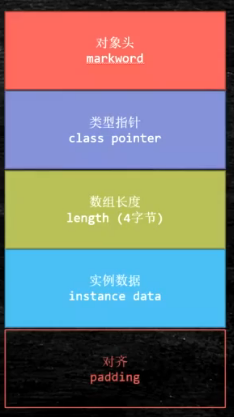
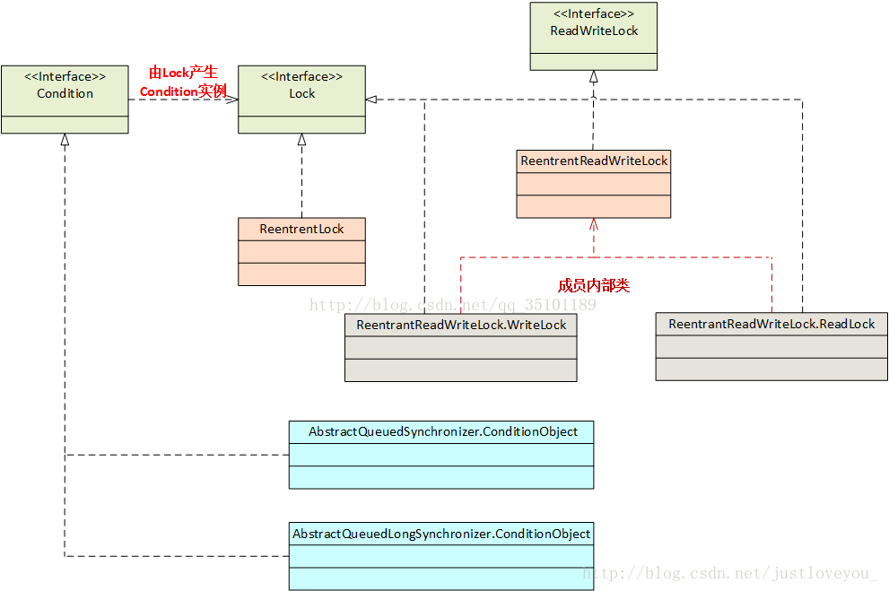
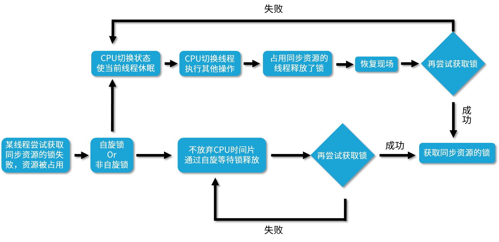

# 并发锁

　　根据分类标准我们把锁分为以下 7 大类别，分别是：

* 偏向锁/轻量级锁/重量级锁：这三种锁特指 synchronized 锁的状态，通过在对象头中的 mark word 来表明锁的状态。

  * 偏向锁

    * 如果自始至终，对于这把锁都不存在竞争，那么其实就没必要上锁，只需要打个标记就行了，这就是偏向锁的思想。一个对象被初始化后，还没有任何线程来获取它的锁时，那么它就是可偏向的，当有第一个线程来访问它并尝试获取锁的时候，它就将这个线程记录下来，以后如果尝试获取锁的线程正是偏向锁的拥有者，就可以直接获得锁，开销很小，性能最好。
  * 重量级锁

    * 重量级锁是互斥锁，它是利用操作系统的同步机制实现的，所以开销相对比较大。当多个线程直接有实际竞争，且锁竞争时间长的时候，轻量级锁不能满足需求，锁就会膨胀为重量级锁。重量级锁会让其他申请却拿不到锁的线程进入阻塞状态。
  * 轻量级锁

    * JVM 开发者发现在很多情况下，synchronized 中的代码是被多个线程交替执行的，而不是同时执行的，也就是说并不存在实际的竞争，或者是只有短时间的锁竞争，用 CAS 就可以解决，这种情况下，用完全互斥的重量级锁是没必要的。轻量级锁是指当锁原来是偏向锁的时候，被另一个线程访问，说明存在竞争，那么偏向锁就会升级为轻量级锁，线程会通过自旋的形式尝试获取锁，而不会陷入阻塞。
* 可重入锁/非可重入锁；

  * 不可重入锁：线程当前持有了这把锁，但是如果想再次获取这把锁，也必须要先释放锁后才能再次尝试获取。
  * 可重入锁：线程当前已经持有这把锁了，能在不释放这把锁的情况下，再次获取这把锁。
* 共享锁/独占锁；

  * 共享锁：同一把锁可以被多个线程同时获得，
  * 独占锁：锁只能同时被一个线程获得。
* 公平锁/非公平锁；

  * 公平锁的公平的含义在于如果线程现在拿不到这把锁，那么线程就都会进入等待，开始排队，在等待队列里等待时间长的线程会优先拿到这把锁，有先来先得的意思。
  * 非公平锁就不那么“完美”了，它会在一定情况下，忽略掉已经在排队的线程，发生插队现象。
* 悲观锁/乐观锁；

  * 悲观锁的概念是在获取资源之前，必须先拿到锁，以便达到“独占”的状态，当前线程在操作资源的时候，其他线程由于不能拿到锁，所以其他线程不能来影响我。
  * 乐观锁恰恰相反，它并不要求在获取资源前拿到锁，也不会锁住资源；相反，乐观锁利用 CAS 理念，在不独占资源的情况下，完成了对资源的修改。
* 自旋锁/非自旋锁；

  * 自旋锁的理念是如果线程现在拿不到锁，并不直接陷入阻塞或者释放 CPU 资源，而是开始利用循环，不停地尝试获取锁，这个循环过程被形象地比喻为“自旋”，就像是线程在“自我旋转”。
  * 非自旋锁的理念就是没有自旋的过程，如果拿不到锁就直接放弃，或者进行其他的处理逻辑，例如去排队、陷入阻塞等。
* 可中断锁/不可中断锁。

  * 在 Java 中，synchronized 关键字修饰的锁代表的是不可中断锁，一旦线程申请了锁，就没有回头路了，只能等到拿到锁以后才能进行其他的逻辑处理。而我们的 ReentrantLock 是一种典型的可中断锁，例如使用 lockInterruptibly 方法在获取锁的过程中，突然不想获取了，那么也可以在中断之后去做其他的事情，不需要一直傻等到获取到锁才离开。

## Synchronized

### 原理:

　　每个对象都有一个monitor锁，当一个monitor被线程持有后会处于锁定状态，使用的是monitorenter和monitorexit指令，其中monitorenter指令指向同步代码块的开始位置，monitorexit指令则指明同步代码块的结束位置。当执行monitorenter指令时，monitor计数器加一，取锁成功，当monitor的计数器为0时释放锁。

　　Synchronized方法锁为该方法所在的对象本身，静态Synchronized方法从Class对象获取

　　**Synchronized是可重入锁**

　　当一个线程请求方法时，会去检查锁状态，如果锁状态是0，代表该锁没有被占用，直接进行CAS操作获取锁，将线程ID替换成自己的线程ID。如果锁状态不是0，代表有线程在访问该方法。此时，如果线程ID是自己的线程ID，如果是可重入锁，会将status自增1，然后获取到该锁，进而执行相应的方法。如果是非重入锁，就会进入阻塞队列等待。释放锁时，可重入锁，每一次退出方法，就会将status减1，直至status的值为0，最后释放该锁。释放锁时，非可重入锁，线程退出方法，直接就会释放该锁。

### 对象的内存布局

　　**jvm默认开启class pointer压缩 为4字节**  
普通对象 markword 默认八个字节 instance data 若属性则为零 padding 补足被8整除  
​  
数组对象  
​​

### 实现

　　MONITORENTER 进入锁
MONITOREXIT 退出锁
在jvm执行过程中实现锁升级

### 锁升级

|锁状态||25位||31位|||1位|4bit|1bit（偏向锁位）|2bit锁标志||
| --------------| -| -----------------------------| -| ----------------------| -| -----| ------| --------| ----------------| ----------| -|
|无锁（new）||unused||　hashcode（如果调用）|||unused|分代年龄|0|0|1|
|||||||||||||
|锁状态||54位||||2位|1位|4bit|1bit（偏向锁位）|2bit锁标志||
|偏向锁||当前线程指针||||Epoch|unused|分代年龄|1|0|1|
|||||||||||||
|锁状态||62位||||||||2bit锁标志||
|轻量锁，自旋锁||指向线程栈中Lock Record的指针||||||||0|0|
|重量级锁||指向互斥量（重量级锁）的指针||||||||1|0|
|GC标记信息||CMS过程中用到的标记信息||||||||1|1|


#### 锁升级流程(hashcode存储到Lock Record)

1. 先new一个对象
2. 若有一个线程进入，将线程id放入对象头中（偏向锁）
3. 若再来一个线程，将使用CAS进行锁竞争，并这小偏向锁标识（自旋锁）（CAS等待自旋会消耗CPU）
4. jdk1.6之前为自旋10次货自旋线程大于CPU核心的一半则进入重量锁 之后则为jvm自适应锁

　　为何要升级到重量锁：升级重量锁后，其他线程进入等待状态，不消耗CPU，但是申请重量锁需要与内核打交道，会消耗资源。

#### 锁粗化

　　jvm检测到一连串操作都对同一对象加锁，此时jvm就会将锁范围加到一连串操作的外围（比如for循环append）

#### 锁消除

　　一个资源为非共享资源，jvm会自动把锁去除（比如只在一个方法内使用StringBuffer的append方法）

## 显式锁

​​

```
Lock和ReadWriteLock是两大锁的根接口
Lock 接口支持重入、公平等的锁规则：实现类 ReentrantLock、ReadLock和WriteLock。
ReadWriteLock 接口定义读取者共享而写入者独占的锁，实现类：ReentrantReadWriteLock。
```

### Lock 类

#### ReentrantLock

　　ReentrantLock方法：

```java
	//传入boolean值,true时create一个公平锁，false为非公平锁
        ReentrantLock(boolean fair) 
  
	//查看有多少线程等待锁
	int getQueueLength()

	//是否有线程等待抢锁
	boolean hasQueuedThreads()

	//是否有指定线程等待抢锁
	boolean hasQueuedThread(Thread thread)

	//当前线程是否抢到锁。返回0代表没有
	int getHoldCount()

	//查询此锁是否由任何线程持有
	boolean isLocked()
	 
	 //是否为公平锁
	boolean isFair() 

```

　　Condition 方法：

```java
public interface Condition {
	/**
	*Condition线程进入阻塞状态,调用signal()或者signalAll()再次唤醒，
	*允许中断如果在阻塞时锁持有线程中断，会抛出异常；
	*重要一点是：在当前持有Lock的线程中，当外部调用会await()后，ReentrantLock就允许其他线程来抢夺锁当前锁，
	*注意：通过创建Condition对象来使线程wait，必须先执行lock.lock方法获得锁
	*/
    void await() throws InterruptedException;

    //Condition线程进入阻塞状态,调用signal()或者signalAll()再次唤醒，不允许中断，如果在阻塞时锁持有线程中断，继续等待唤醒
    void awaitUninterruptibly();

    //设置阻塞时间，超时继续，超时时间单位为纳秒，其他同await()；返回时间大于零，表示是被唤醒，等待时间并且可以作为等待时间期望值，小于零表示超时
    long awaitNanos(long nanosTimeout) throws InterruptedException;

	//类似awaitNanos(long nanosTimeout);返回值：被唤醒true，超时false
    boolean await(long time, TimeUnit unit) throws InterruptedException;

   //类似await(long time, TimeUnit unit) 
    boolean awaitUntil(Date deadline) throws InterruptedException;

   //唤醒指定线程
    void signal();

    //唤醒全部线程
    void signalAll();
}

```

> Condition是Lock上的一个条件，可以多次newCondition()获得多个条件，Condition可用于线程间通信，通过Condition能够更加精细的控制多线程的休眠与唤醒

> ReentrantLock.Condition线程通信注意点：  
> 	1. 使用**ReentrantLock.Condition的signal()、await()、signalAll()方法使用之前必须要先进行lock()操作**[记得unlock()]，类似使用Object的notify()、wait()、notifyAll()之前必须要对Object对象进行synchronized操作；否则就会抛IllegalMonitorStateException；  
> 	2. 注意在使用**ReentrantLock.Condition中使用signal()、await()、signalAll()方法，不能和Object的notify()、wait()、notifyAll()方法混用，否则抛出IllegalMonitorStateException`;

#### ReentrantReadWriteLock

##### 读写锁的实现分析

　　读写锁因为也是维护一个整数状态(volatile修饰)，但是因为是一个整数，需要保证读写，两种状态，所以对32位整型进行了高16位和低16位的设计，其中高16为代表读锁，低16为代表写锁。

* 写锁的获取与释放  
          写锁是一个可重入的锁，允许同一个线程重复获取锁，所以在获取锁的逻辑中会进行是否当前线程以及是否有其他读线程的状态判断。如果当前线程在获取写锁时，读锁已经被获取(读状态不为0)，或者该线程不是已经获得了写锁的线程，则当前线程进入等待状态。  
  写锁的释放和ReentrantLock的释放很像，当释放锁时，需要对状态递减一，并且前一次写线程修改对后续读线程可见。

* 读锁的获取与释放  
         读锁是一个可重入锁，在没有其他写线程时，读锁总是可以成功的获取，安全地进行状态加1。state这个值可以判断整个读锁被获得了多少次，而每个线程获取读锁的次数，是存储在ThreadLocal中的。  
  读锁的每次释放均线程安全的减少读状态

##### 锁降级

　　锁降级指的是一个线程先拥有写锁，然后拥有读锁，在对数据处理完成后，释放写锁，此时该线程所持有的锁是读锁，从写锁降级为读锁。

## 自旋锁

### CAS （Compare and Swap（比较与交换））

　　CAS是实现自旋锁的基础

　　CAS的原理：

　　	线程从内存中取值i 赋值给k 对k进行运算，运算完毕后与内存中的i值进行比较，若相等证明无线程修改i ，结果正确，更新结果值。若不相等则证明有其他线程修改过该值，结果不正确进行重试。

　　‍

### 自旋锁

> 自旋锁和非自旋锁的获取锁的过程。

​​

　　自旋锁，它并不会放弃  CPU  时间片，而是通过自旋等待锁的释放，也就是说，它会不停地再次地尝试获取锁，如果失败就再次尝试，直到成功为止。

　　非自旋锁，如果它发现此时获取不到锁，它就把自己的线程切换状态，让线程休眠，然后 CPU 就可以在这段时间去做很多其他的事情，直到之前持有这把锁的线程释放了锁，于是 CPU 再把之前的线程恢复回来，让这个线程再去尝试获取这把锁。如果再次失败，就再次让线程休眠，如果成功，一样可以成功获取到同步资源的锁。

* 优点

  * 自旋锁用循环去不停地尝试获取锁，让线程始终处于 Runnable 状态，节省了线程状态切换带来的开销。

* 缺点

  * 虽然避免了线程切换的开销，但是它在避免线程切换开销的同时也带来了新的开销，因为它需要不停得去尝试获取锁。如果这把锁一直不能被释放，那么这种尝试只是无用的尝试，会白白浪费处理器资源。也就是说，虽然一开始自旋锁的开销低于线程切换，但是随着时间的增加，这种开销也是水涨船高，后期甚至会超过线程切换的开销，得不偿失。

### 注意事项

　　‍

　　**虽然避免了线程切换的开销，但是它在避免线程切换开销的同时也带来了新的开销，因为它需要不停得去尝试获取锁。如果这把锁一直不能被释放，那么这种尝试只是无用的尝试，会白白浪费处理器资源。**

　　**ABA问题**

### 适应场景

　　适用于并发度不是特别高的场景，以及临界区比较短小的情况，这样我们可以利用避免线程切换来提高效率。如果临界区很大，线程一旦拿到锁，很久才会释放的话，那就不合适用自旋锁，因为自旋会一直占用 CPU 却无法拿到锁，白白消耗资源。

　　‍

　　‍

　　‍

　　‍

　　‍

　　‍

　　‍

　　‍

　　‍

## 问题

### Synchronized 和 Lock 区别

```
synchronized是java内置关键字，在jvm层面，Lock是个java类；
synchronized无法判断是否获取锁的状态，Lock可以判断是否获取到锁；
synchronized会自动释放锁(a 线程执行完同步代码会释放锁 ；b 线程执行过程中发生异常会释放锁)，Lock需在finally中手工释放锁（unlock()方法释放锁），否则容易造成线程死锁；
用synchronized关键字的两个线程1和线程2，如果当前线程1获得锁，线程2线程等待。如果线程1阻塞，线程2则会一直等待下去，而Lock锁就不一定会等待下去，如果尝试获取不到锁，线程可以不用一直等待就结束了；
synchronized的锁可重入、不可中断、非公平，而Lock锁可重入、可判断、可公平（两者皆可）
Lock锁适合大量同步的代码的同步问题，synchronized锁适合代码少量的同步问题。
```

　　‍
