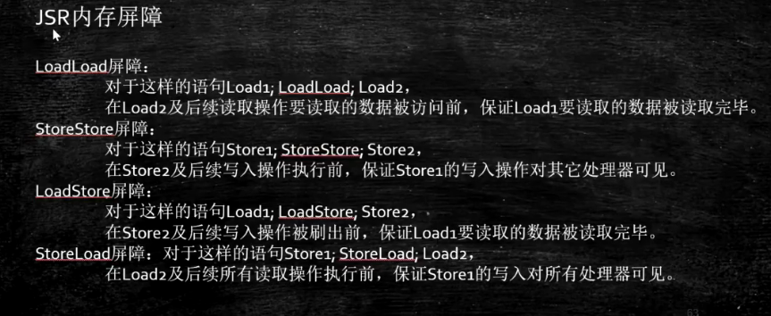

# 线程间通讯

## 线程通信

### 线程间通信常用方式

1. 休眠唤醒
   1. object 的 wait，notify，notifyAll
   2. Condition 的 await，signal，signalAll
2. CountDownLatch：用于某个线程 A 等待若干个其他线程执行完之后，它才执行
   - CountDownLatch 这个类能够使一个线程等待其他线程完成各自的工作后再执行。
   - CountDownLatch 是通过一个计数器来实现的，计数器的初始值为线程的数量。  

　　每当一个线程完成了自己的任务后，计数器的值就会减 1。当计数器值到达 0 时，它表示所有的线程已经完成了任务，然后在闭锁上等待的线程就可以恢复执行任务。
3. CyclicBarrier：一组线程等待至某个状态之后再全部同时执行

- CyclicBarrier 实现让一组线程等待至某个状态之后再全部同时执行。
- CyclicBarrier 底层是 ReentrantLock 和 Condition 实现

4. Semaphore：用于控制对某组资源的访问权限

　　**Object 和 Condition 休眠唤醒区别**

1. object wait()必须在 synchronized（同步锁）下使用，
2. object wait()必须要通过 Nodify()方法进行唤醒
3. condition await() 必须和 Lock（互斥锁/共享锁）配合使用
4. condition await() 必须通过 signal() 方法进行唤醒

　　**sleep 和 wait 区别**

||wait|sleep|
| ----------| -----------------------------------------------------------------------------| ----------------------------------------------------|
|同步|只能在同步上下文中调用 wait 方法，否则会抛出 llegalMonitorstateException 异常|不需要在同步方法或同步代码块调用|
|作用对象|wait 方法定义在 Object 类中，作用于对象本身|sleep 方法定义在 java.lang.thread 中，作用于当前线程|
|释放锁资源|是|否|
|唤醒条件|其他线程调用对象的 notify()或者 notifyAll()方法|超时或调用 Interrupt()方法体|
|方法属性|wait 是实例方法|sleep 是静态方法|

　　**wait 和 notify 区别**

* wait 和 notify 都是 Object 中的方法
* wait 和 notify 执行前线程都必须获得对象锁
* wait 的作用是使当前线程进行等待
* notify 的作用是通知其他等待当前线程的对象锁的线程

## Volatile 关键字

### 非原子性的64位操作

　　非Volatile修饰的64位变量（double和long类型），JVM允许将64位的读操作和写操作分为两个32位的操作，如果这两个操作在不同线程执行，可能就会导致数据丢失。在多线程中使用共享且可变的long和double类型变量，必须使用Volatile修饰或加锁，否则会有线程安全问题。

### 原理

　　Java把处理器多级抽象化为JMM，及线程私有化的工作内存和线程共有的主内存，每个线程从主内村拷贝所需数据到自己的工作内存处理，在重新写回主内存。volatile原理就是当线程修改volatile修饰的变量时，要立即写入内存，当线程读取被volatile修饰的变量时，要立即到主存中读取，保证可见性。

### 作用

> 一个共享变量（类的成员变量、类的静态成员变量）被 volatile 修饰之后，那么就具备了两层语义：

* 保证了不同线程对这个变量进行操作时的可见性，即一个线程修改了某个变量的值，这新值对其他线程来说是立即可见的。（注意：不保证原子性）
* 禁止进行指令重排序。（保证变量所在行的有序性）

  * 当程序执行到 volatile 变量的读操作或者写操作时，在其前面的操作的更改肯定全部已经进行，且结果已经对后面的操作可见；在其后面的操作肯定还没有进行；
  * 在进行指令优化时，不能将在对 volatile 变量访问的语句放在其后面执行，也不能把 volatile 变量后面的语句放到其前面执行

### 内存屏障

　　**MESI CPU缓存一致性协议**  
屏障两边的指令不可重排  
​  
​**应用场景**

　　基于 volatile 的作用，使用 volatile 必须满足以下两个条件：

* 对变量的写操作不依赖于当前值
* 该变量没有包含在具有其他变量的不变式中
* 在访问变量时不需要加锁  
  **常见应用场景如下：**   
  状态量标记：

```java
volatile boolean flag = false;
 
while(!flag){
    doSomething();
}
 
public void setFlag() {
    flag = true;
}


volatile boolean inited = false;
//线程1:
context = loadContext(); 
inited = true;           
 
//线程2:
while(!inited ){
sleep()
}
doSomethingwithconfig(context);
```

　　双重校验：

```java
class Singleton{
    private volatile static Singleton instance = null;
 
    private Singleton() {
 
    }
 
    public static Singleton getInstance() {
        if(instance==null) {
            synchronized (Singleton.class) {
                if(instance==null)
                    instance = new Singleton();
            }
        }
        return instance;
    }
}
```

### 局限

　　Volatile修饰变量只能保证可见性，不能保证原子性

　　‍
