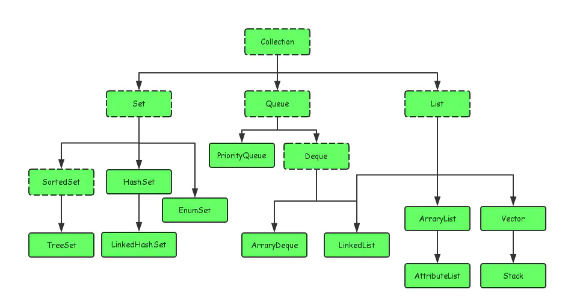
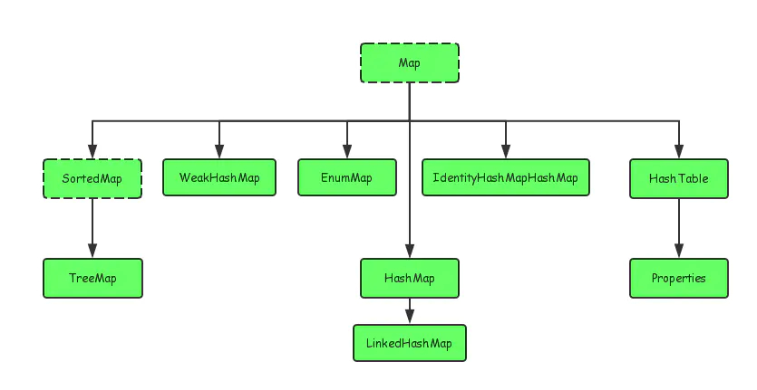

# Collection

# Collection

​​

​​

- Collection 接口的接口 对象的集合
  - List 子接口 按进入先后有序保存 可重复
    - LinkedList(双向链表) 接口实现类 链表 插入删除 没有同步 线程不安全
    - ArrayList(Object 数组) 接口实现类 数组 随机访问 没有同步 线程不安全
    - Vector(Object 数组) 接口实现类 数组 同步 线程安全
  - Set 子接口 不可重复
    - HashSet(无序，唯一)
    - LinkedHashSet(有序，唯一)
      线程不安全
    - TreeSet(有序，唯一)
- Map 接口 键值对的集合
  - Hashtable(链表+数组) 接口实现类 同步 线程安全
  - HashMap(1.8 之前数组+链表，1.8 之后达到一定长度会转化为红黑树) 接口实现类 没有同步 线程不安全
    - LinkedHashMap(在 HashMap 基础上添加一条双向链表)
  - TreeMap(红黑树(自平衡排序二叉树))

## Iterable

　　**Iterator 也是一个接口，它只有三个方法：**

- hasNext()
- next()
- remove()

## ArrayList 与 LinkedList 区别

- 都不保证线程安全
- ArrayList 底层是数组，LinkedList 底层使用双向链表（1.6 之前为循环链表，1.7 之后取消循环）
- ArrayList 采用数组存储，删除和插入的时间复杂度会受元素位置影响。LinkedList 采用链式存储，对于插入删除不受元素位置影响
- LinkedList 不支持随机访问，ArrayList 支持元素序号访问
- ArrayList 会在列表结尾预留一定空余空间，LinkedList 每个节点所消耗的空间比 ArrayList 大

## HashMap 和 Hashtable 区别

- HashMap 是非线程安全的，HashTable 是线程安全的 (如果你要保证线程安全的话就使用 ConcurrentHashMap 吧,效率比 hashtable 高)；
- HashMap 中，null 可以作为键，这样的键只有一个，可以有一个或多个键所对应的值为 null。。但是在 HashTable 中 put 进的键值只要有一个 null，直接抛出 NullPointerException。
- 初始化
  - ① 创建时如果不指定容量初始值： Hashtable 默认的**初始大小为 11**，之后每次扩充，容量变为原来的 2n+1。HashMap 默认的**初始化大小为 16**。之后每次扩充，容量变为原来的 2 倍。
  - ② 创建时如果给定了容量初始值：Hashtable 会直接使用你给定的大小，而 HashMap 会将其扩充为 2 的幂次方大小
- JDK1.8 以后的 HashMap 在解决哈希冲突时有了较大的变化，当链表长度大于阈值（默认为 8）（**将链表转换成红黑树前会判断，如果当前数组的长度小于 64，那么会选择先进行数组扩容，而不是转换为红黑树**）时，将链表转化为红黑树，以减少搜索时间。Hashtable 没有这样的机制。

## ConcurrentHashMap 和 Hashtable 的区别

　　ConcurrentHashMap 和 Hashtable 的区别主要体现在实现线程安全的方式上不同。

- 底层数据结构： JDK1.7 的 ConcurrentHashMap 底层采用 **分段的数组+链表** 实现，JDK1.8 采用的数据结构跟 HashMap1.8 的结构一样，**数组+链表/红黑二叉树**。Hashtable 和 JDK1.8 之前的 HashMap 的底层数据结构类似都是采用 **数组+链表** 的形式，数组是 HashMap 的主体，链表则是主要为了解决哈希冲突而存在的；
- 实现线程安全的方式（重要）：
  - ① 在 JDK1.7 的时候，ConcurrentHashMap（分段锁） 对整个桶数组进行了分割分段(Segment)，每一把锁只锁容器其中一部分数据，多线程访问容器里不同数据段的数据，就不会存在锁竞争，提高并发访问率。 到了 JDK1.8 的时候已经摒弃了 Segment 的概念，而是直接用 Node 数组+链表+红黑树的数据结构来实现，并发控制使用 synchronized 和 CAS 来操作。（JDK1.6 以后 对 synchronized 锁做了很多优化） 整个看起来就像是优化过且线程安全的 HashMap，虽然在 JDK1.8 中还能看到 Segment 的数据结构，但是已经简化了属性，只是为了兼容旧版本；
  - ② Hashtable(同一把锁) :使用 synchronized 来保证线程安全，效率非常低下。当一个线程访问同步方法时，其他线程也访问同步方法，可能会进入阻塞或轮询状态，如使用 put 添加元素，另一个线程不能使用 put 添加元素，也不能使用 get，竞争会越来越激烈效率越低。

## HashTable：全表锁

## JDK7 的 ConcurrentHashMap：

　　首先将数据分为一段一段的存储，然后给每一段数据配一把锁，当一个线程占用锁访问其中一个段数据时，其他段的数据也能被其他线程访问。

　　一个 `ConcurrentHashMap` 里包含一个 `Segment(片段)` 数组。`Segment` 的结构和 `HashMap` 类似，是一种数组和链表结构，一个 `Segment` 包含一个 `HashEntry` 数组，每个 `HashEntry` 是一个链表结构的元素，每个 `Segment` 守护着一个 `HashEntry` 数组里的元素，当对 `HashEntry` 数组的数据进行修改时，必须首先获得对应的 `Segment` 的锁。

　　[https://imgchr.com/i/t2J5Kx](https://imgchr.com/i/t2J5Kx)

## JDK1.8 的 ConcurrentHashMap（TreeBin: 红黑二叉树节点 Node: 链表节点）`

　　​**​`1.8之前ConcurrentHashMap将hashmap数组分段，对于每个段加锁。而在1.8后几乎与hashmap类似，只是更改了put操作，在计算hash值和索引位置后会先判断数组是否正在扩容。若正在扩容则调用扩容辅助函数。没有则在判断是否为空，为空则采用csa方法放入数组，若不为空则使用synchronized锁住该节点，根据链表或红黑树选择插入方法。最后判断长度，为8则开始转换红黑树。`​** ​ `synchronized `​只锁定当前链表或红黑二叉树的首节点，这样只要 hash 不冲突，就不会产生并发，效率又提升 N 倍。

​​

## HashMap 和 HashSet 区别

　　**HashSet 底层就是基于 HashMap 实现的**

|HashMap|HashSet|
| ----------------------------------| ------------------------------------------------------------------------|
|实现了 Map 接口|实现 Set 接口|
|存储键值对|仅存储对象|
|调用 put()向 map 中添加元素|调用 add()方法向 Set 中添加元素|
|HashMap 使用键（Key）计算 Hashcode|HashSet 使用成员对象来计算 hashcode 值，对于两个对象来说 hashcode 可能相|
