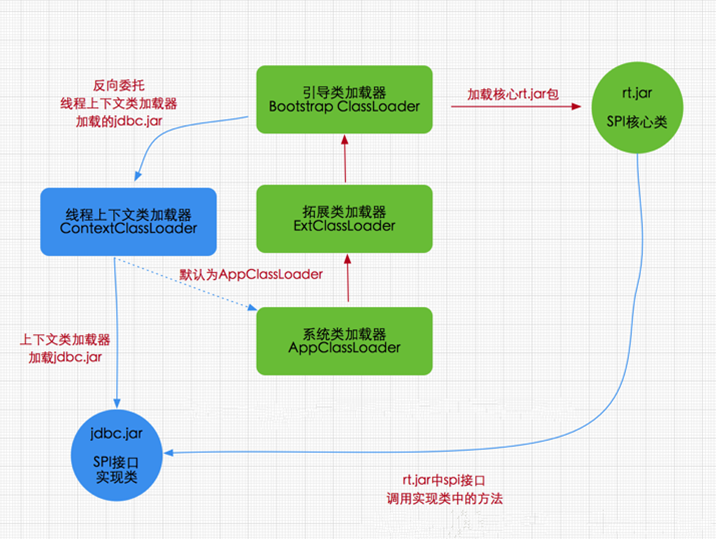
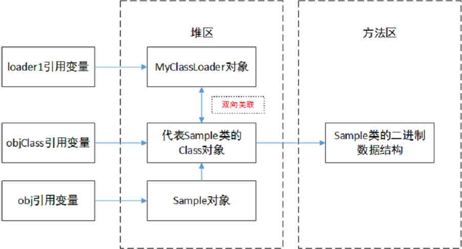

# JVM

## GC评估标准

### 吞吐量

> CPU用于运行用户代码的时间与CPU总消耗时间的比值，即吞吐量 = 运行用户代码时间 /（运行用户代码时间 + 垃圾收集时间）。

* 吞吐量就是比如：虚拟机总共运行了100分钟，其中垃圾收集花掉1分钟，那吞吐量就是99%。

* 这种情况下，应用程序能容忍较高的暂停时间。因此，高吞吐量的应用程序有更长的时间基准，快速响应是不必考虑的。

* 吞吐量优先，意味着在单位时间内，STW的时间最短：0.2 + 0.2 = 0.4

### 暂停时间

> 指一个时间段内应用程序线程暂停，让GC线程执行的状态

* GC期间100毫秒的暂停时间意味着在这100毫秒期间内没有应用程序线程是活动的。

* 暂停时间优先，意味着尽可能让单次STW的时间最短

## 为何永久代被元空间替代

- 永久代有固定上限，无法进行调整，而元空间直接使用内存，受本机可用内存限制。
- 元空间里存放的是类的元数据，加载多少类的元数据由系统的实际可用空间来控制，可以加载更多的类
- JDK8 合并 HotSpot 和 JRockit 代码时，jrockit 不存在永久代，所以合并后没必要设置一个永生代位置

## 双亲委托优点和缺点

　　优点：

* 避免类重复加载，确保全局唯一
* 保护程序，防止核心api被修改

　　缺点：

* 检查类是否加载的委托过程是单向的，顶层的ClassLoader无法访问底层的ClassLoader所加载的类。

## 双亲委派机制的破坏

### 线程上下文类加载器

> 通过java.lang.Thread类的setContextClassLoader()方法进行设置，如果创建线程时还未设置，它将会从父线程中继承一个，如果在应用程序的全局范围内都没有设置过的话，那这个类加载器默认就是应用程序类加载器。

​​

### 热部署（热替换）

> 服务不能中断，修改必须立即表现正在运行的系统之中

## 类、类的加载器、类的实例之间的引用关系

　　在类加载器的内部实现中，用一个Java集合来存放所加载类的引用。另一方面，一个Class对象总是会引用它的类加载器，调用Class对象的getClassLoader()方法，就能获得它的类加载器。由此可见，代表某个类的Class实例与其类的加载器之间为双向关联关系。

　　一个类的实例总是引用代表这个类的Class对象。在Object类中定义了getClass()方法，这个方法返回代表对象所属类的Class对象的引用。此外，所有的Java类都有一个静态属性class，它引用代表这个类的Class对象。

​​

## to区域被填满了，to区中的有的对象年龄还没被复制15次，也会被移动到年老代中吗？

　　Minor GC会一直重复`from to`​的过程,直到“To”区被填满,“To”区被填满之后,会将所有对象移动到年老代中。默认情况下,如果对象年龄达到15岁,就会移动到老年代中。
