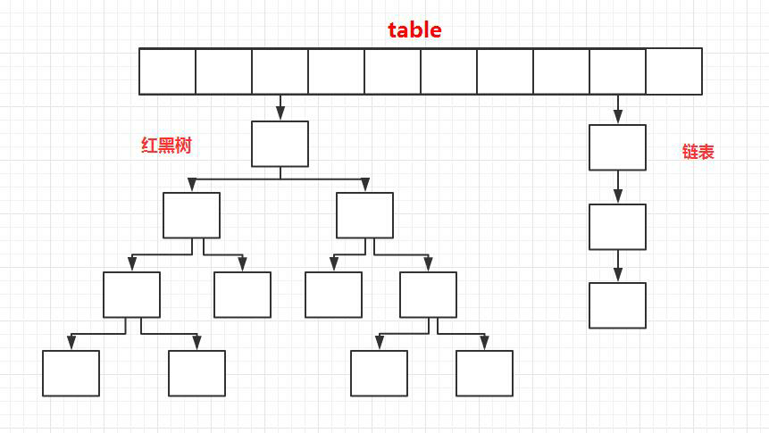

# Map

## HashMap

　　JDK1.8 之前 HashMap 底层是 **数组和链表** 结合在一起使用也就是 **链表散列**。HashMap 通过 key 的 hashCode 经过扰动函数处理过后得到 hash 值，然后通过 (n - 1) & hash 判断当前元素存放的位置（这里的 n 指的是数组的长度），如果当前位置存在元素的话，就判断该元素与要存入的元素的 hash 值以及 key 是否相同，如果相同的话，直接覆盖，不相同就通过拉链法解决冲突。

　　所谓扰动函数指的就是 HashMap 的 hash 方法。使用 hash 方法也就是扰动函数是为了防止一些实现比较差的 hashCode() 方法 换句话说使用扰动函数之后可以减少碰撞。

### JDK1.8 之前

　　“拉链法” 就是：将链表和数组相结合。也就是说创建一个链表数组，数组中每一格就是一个链表。若遇到哈希冲突，则将冲突的值加到链表中即可。

### JDK1.8 之后

　　当链表长度大于阈值（默认为 8）（将链表转换成红黑树前会判断，如果当前数组的长度小于 64，那么会选择先进行数组扩容，而不是转换为红黑树）时，将链表转化为红黑树，以减少搜索时间。



> TreeMap、TreeSet 以及 JDK1.8 之后的 HashMap 底层都用到了红黑树。红黑树就是为了解决二叉查找树的缺陷，因为二叉查找树在某些情况下会退化成一个线性结构。

## ConcurrentHashMap

　　1.8及之后

> 1. 用table保存数据，锁的粒度更小，减少并发冲突的概率。采用table数组元素作为锁，从而实现了对每一行数据进行加锁，进一步减少并发冲突的概率，并发控制使用Synchronized和CAS来操作。
> 2. 存储数据时采用了数组+ 链表+红黑树的形式。

1. CurrentHashMap重要参数：

```java
private static final int MAXIMUM_CAPACITY = 1 << 30; // 数组的最大值 

private static final int DEFAULT_CAPACITY = 16; // 默认数组长度 

static final int TREEIFY_THRESHOLD = 8; // 链表转红黑树的一个条件 

static final int UNTREEIFY_THRESHOLD = 6; // 红黑树转链表的一个条件 

static final int MIN_TREEIFY_CAPACITY = 64; // 链表转红黑树的另一个条件

static final int MOVED     = -1;  // 表示正在扩容转移 

static final int TREEBIN   = -2; // 表示已经转换成树 

static final int RESERVED  = -3; // hash for transient reservations 

static final int HASH_BITS = 0x7fffffff; // 获得hash值的辅助参数

transient volatile Node<K,V>[] table;// 默认没初始化的数组，用来保存元素 

private transient volatile Node<K,V>[] nextTable; // 转移的时候用的数组 

static final int NCPU = Runtime.getRuntime().availableProcessors();// 获取可用的CPU个数 

private transient volatile Node<K,V>[] nextTable; // 连接表，用于哈希表扩容，扩容完成后会被重置为 null 

private transient volatile long baseCount; //保存着整个哈希表中存储的所有的结点的个数总和，有点类似于 HashMap 的 size 属性。
private transient volatile int sizeCtl; 
//sizeCtl = 0：表示没有指定初始容量
//sizeCtl > 0：表示初始容量(可以使用阶段)
//sizeCtl = -1,标记作用，告知其他线程，正在初始化
//sizeCtl = 0.75n ,扩容阈值
//sizeCtl < 0 : 表示有其他线程正在执行扩容or初始化(不能使用阶段)
//sizeCtl = (resizeStamp(n) << RESIZE_STAMP_SHIFT) + 2 :表示此时只有一个线程在执行扩容
```

2. 扩容机制

> - nextTable: 扩容期间，将元素迁移到 nextTable 新Map, nextTable是共享变量。
> - sizeCtl: 多线程之间，sizeCtl来判断ConcurrentHashMap当前所处的状态。
>   - 通过CAS设置sizeCtl属性，告知其他线程ConcurrentHashMap的状态变更。
> - transferIndex: 扩容索引，表示已经完成数据分配的table数组索引位置。
>   - 数据转移已经到了哪个位置? 其他线程根据这个值帮助扩容从这个索引位置继续转移数据
> - ForwardingNode节点: 标记作用,表示此节点已经扩容完毕，hash值等于-1
>   - 数组位置的数据已经被转移到新Map中,此位置就会被设置为这个属性
>   - 这个属性包装了新Map,可以用find方法取扩容转移后的值

　　**扩容流程：**

- 线程执行put操作，发现容量已经达到扩容阈值，需要进行扩容操作
- 扩容线程A 以CAS机制修改`transferindex`值,然后按照降序迁移数据,`transferindex`是数组尾部的索引
  - `transferindex`的初始值: 新数组的长度 - 1 -> 就是数组的最后一位
- 迁移hash桶时，会将桶内的链表或者红黑树，按照一定算法，拆分成2份，将其插入`nextTable[i]`和`nextTable[i+n]`（n是之前table数组的长度）。
  - 扩容后重新计算的hash值与之前hash值一样,则存放位置不变
  - 重新计算的hash值与之前hash值不一样,则存放再索引i +n处(之前的数组长度 + 计算的索引)
- 迁移完毕的hash桶,都会被设置成`ForwardingNode`节点，以此告知访问此桶的其他线程，此节点已经迁移完毕,但数据并没有全部迁移完成。
- 此时线程2访问到了`ForwardingNode`节点，如果线程2执行的put或remove等写操作，那么就会先帮其扩容。
  - 如果线程2执行的是get等读方法，则会调用`ForwardingNode`的find方法，去`nextTable`里面查找相关元素。

3. put

> put操作采用 CAS + synchronized 实现并发插入或更新操作

```java
// Node 节点的 hash值在HashMap中存储的就是hash值，在currenthashmap中可能有多种情况哦！
/** Implementation for put and putIfAbsent */
    final V putVal(K key, V value, boolean onlyIfAbsent) {
        if (key == null || value == null) throw new NullPointerException();
        int hash = spread(key.hashCode());// 最终hash值计算
        int binCount = 0;
        for (Node<K,V>[] tab = table;;) { //循环表
            Node<K,V> f; int n, i, fh; K fk; V fv;
            if (tab == null || (n = tab.length) == 0)
                tab = initTable(); // 初始化表 如果为空,懒汉式
            else if ((f = tabAt(tab, i = (n - 1) & hash)) == null) {
                //// 如果对应桶位置为空
                if (casTabAt(tab, i, null, new Node<K,V>(hash, key, value)))
                    break;                    // CAS 原子性的尝试插入
            }
            else if ((fh = f.hash) == MOVED)
                //f.hash == MOVED 表示为：ForwardingNode，说明其他线程正在扩容
                //并且这个数组的位置数据已经转移到新的数组结构中
                //但是数据还没有全部转移完成,帮助线程先扩容
                // 如果当前节点正在扩容。还要帮着去扩容 
                tab = helpTransfer(tab, f);
            else if (onlyIfAbsent //jdk 检查第一个节点 是否已存在key 存在返回对应value值 check first node without acquiring lock
                     && fh == hash
                     && ((fk = f.key) == key || (fk != null && key.equals(fk)))
                     && (fv = f.val) != null)
                return fv;
            else {
                V oldVal = null;//桶存在数据 加锁操作进行处理
                synchronized (f) {
                    if (tabAt(tab, i) == f) {
                        if (fh >= 0) {// 如果存储的是链表 存储的是节点的hash值
                            binCount = 1;
                            for (Node<K,V> e = f;; ++binCount) {
                                K ek;
                                // 遍历链表去查找，如果找到key 选择性覆盖
                                if (e.hash == hash &&
                                    ((ek = e.key) == key ||
                                     (ek != null && key.equals(ek)))) {
                                    oldVal = e.val;
                                    if (!onlyIfAbsent)
                                        e.val = value;
                                    break;
                                }
                                Node<K,V> pred = e;
                                if ((e = e.next) == null) {// 找到尾部插入
                                    pred.next = new Node<K,V>(hash, key, value);
                                    break;
                                }
                            }
                        }
                        else if (f instanceof TreeBin) {// 如果桶节点类型为TreeBin
                            Node<K,V> p;
                            binCount = 2;
                            if ((p = ((TreeBin<K,V>)f).putTreeVal(hash, key,
                                                           value)) != null) {
                                 // 尝试红黑树插入，同时也要防止节点本来就有，选择性覆盖
                                oldVal = p.val;
                                if (!onlyIfAbsent)
                                    p.val = value;
                            }
                        }
                        else if (f instanceof ReservationNode)
                            throw new IllegalStateException("Recursive update");
                    }
                }
                if (binCount != 0) {// 如果链表数量
                    if (binCount >= TREEIFY_THRESHOLD)
                        treeifyBin(tab, i);//  链表转红黑树哦！
                    if (oldVal != null)
                        return oldVal;
                    break;
                }
            }
        }
        addCount(1L, binCount); // 统计大小 并且检查是否要扩容。
        return null;
    }
```

　　涉及到重要函数initTable、tabAt、casTabAt、helpTransfer、putTreeVal、treeifyBin、addCount函数。

3. initTable

>  **「只允许一个线程」** 对表进行初始化，如果不巧有其他线程进来了，那么会让其他线程交出 CPU 等待下次系统调度Thread.yield。这样，保证了表同时只会被一个线程初始化，对于table的大小，会根据sizeCtl的值进行设置，如果没有设置szieCtl的值，那么默认生成的table大小为16，否则，会根据sizeCtl的大小设置table大小。

```java
// 容器初始化 操作
private final Node<K,V>[] initTable() {
    Node<K,V>[] tab; int sc;
    while ((tab = table)  null || tab.length  0) {
        if ((sc = sizeCtl) < 0) // 如果正在初始化-1，-N 正在扩容。
            Thread.yield(); // 进行线程让步等待
     // 让掉当前线程 CPU 的时间片，使正在运行中的线程重新变成就绪状态，并重新竞争 CPU 的调度权。
     // 它可能会获取到，也有可能被其他线程获取到。
        else if (U.compareAndSwapInt(this, SIZECTL, sc, -1)) { 
          //  比较sizeCtl的值与sc是否相等，相等则用 -1 替换,这表明我这个线程在进行初始化了！
            try {
                if ((tab = table)  null || tab.length  0) {
                    int n = (sc > 0) ? sc : DEFAULT_CAPACITY; // 默认为16
                    @SuppressWarnings("unchecked")
                    Node<K,V>[] nt = (Node<K,V>[])new Node<?,?>[n];
                    table = tab = nt;
                    sc = n - (n >>> 2); 
                }
            } finally {
                sizeCtl = sc; //设置sizeCtl 类似threshold
            }
            break;
        }
    }
    return tab;
}
```
