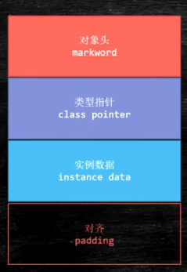

# 虚拟机中的对象

　　‍

## 虚拟机类加载机制

　　
*类的生命周期*
_加载，验证，准备，初始化_和_卸载_这五个顺序是可以确定的，类型的加载过成必须按照这种顺序按部就班的_**开始，** _而_解析_阶段可以在初始化阶段后再开始。（并非完成一步后再进行其他部分，通常可以交叉混合进行）
有且只有六种情况必须对类立刻进行_**初始化**_（加载，验证等在此之前已完成）；

- 遇到 new getstatic，putstatic或invokestatic四条字节码指令时，如果类型没有进行初始化，则会先出发其初始化阶段。生成该四种指令的典型java代码有：
  - new 一个实例对象
  - 读取或设置一个类型的静态字段（被final修饰或已在编译器把结果放入常量池的静态字段除外）
  - 调用一个类型的静态方法的时候
- 使用java.lang.reflect包的方法对类型进行反射调用的时候，如果类型没有进行过初始化，则需 要先触发其初始化。
- 当初始化类的时候，如果发现其父类还没有进行过初始化，则需要先触发其父类的初始化。
- 当虚拟机启动时，用户需要指定一个要执行的主类（包含main()方法的那个类），虚拟机会先 初始化这个主类
- 当一个接口中定义了JDK 8新加入的默认方法（被default关键字修饰的接口方法）时，如果有 这个接口的实现类发生了初始化，那该接口要在其之前被初始化。
- ** 当使用JDK 7新加入的动态语言支持时？？？**

### 加载

　　 在加载阶段，Java虚拟机需要完成以下三件事情：

- 通过一个类的全限定名来获取定义此类的二进制字节流。
- 将这个字节流所代表的静态存储结构转化为方法区的运行时数据结构。
- 在内存中生成一个代表这个类的java.lang.Class对象，作为方法区这个类的各种数据的访问入 口。

### 验证

- 文件格式验证：检验文件是否符合Class文件规范，从而保证输入的字节流能够正确的解析并存储于方法区内。
  - 是否以魔数0xCAFEBABE开头。 ·主、次版本号是否在当前Java虚拟机接受范围之内。
  - 常量池的常量中是否有不被支持的常量类型（检查常量tag标志）。
  - 指向常量的各种索引值中是否有指向不存在的常量或不符合类型的常量。
  - CONSTANT_Utf8_info型的常量中是否有不符合UTF-8编码的数据。
  - Class文件中各个部分及文件本身是否有被删除的或附加的其他信息。
  - ........ 等
- 元数据验证：对字节码描述的信息进行语义分析
  - 这个类是否有父类（除了java.lang.Object之外，所有的类都应当有父类）。
  - 这个类的父类是否继承了不允许被继承的类（被final修饰的类）。
  - 如果这个类不是抽象类，是否实现了其父类或接口之中要求实现的所有方法。
  - 类中的字段、方法是否与父类产生矛盾（例如覆盖了父类的final字段，或者出现不符合规则的方 法重载，例如方法参数都一致，但返回值类型却不同等）。
  - ...........等
- 字节码验证：主要是通过数据流分析和控制流分析，确定程序语义是否合法、符合逻辑。
  - 保证任意时刻操作数栈的数据类型与指令代码序列都能配合工作，例如不会出现类似于“在操作 栈放置了一个int类型的数据，使用时却按long类型来加载入本地变量表中”这样的情况。
  - 保证任何跳转指令都不会跳转到方法体以外的字节码指令上。
  - 保证方法体中的类型转换总是有效的，例如可以把一个子类对象赋值给父类数据类型，这是安全的，但是把父类对象赋值给子类数据类型，甚至把对象赋值给与它毫无继承关系、完全不相干的一个 数据类型，则是危险和不合法的。
  - ……
- 符号引用验证： 发生在虚拟机将符号引用转化为直接引用的时候。符号引用验证可以看作是对类自身以外（常量池中的各种符号 引用）的各类信息进行匹配性校验，通俗来说就是，该类是否缺少或者被禁止访问它依赖的某些外部 类、方法、字段等资源。
  - 符号引用中通过字符串描述的全限定名是否能找到对应的类。
  - 在指定类中是否存在符合方法的字段描述符及简单名称所描述的方法和字段。
  - 符号引用中的类、字段、方法的可访问性（private、protected、public、）是否可被当 前类访问。
  - …… 等

### 准备

　　正式为类中定义的变量（即静态变量，被static修饰的变量）分配内存并设置类变量初始值（值“通常情况”下是数据类型的零值）
如果类字段的字段属性表中存在ConstantValue属性，那在准备阶段变量值就会被初始化为ConstantValue属性所指定的初始值。

> - ConstantValue属于属性表集合中的一个属性，属性表集合中一共有21个不同属性。
> - ConstantValue属性的使用位置：字段表；含义：final关键字定义的常量值。
> - ConstantValue属性作用：通知虚拟机自动为静态变量赋值。

　　int x =123; static int x = 123;

> - 对虚拟机来说上面两种变量赋值的方式和时刻都有所不同。
> - 非static类型变量（实例变量）
>   - 赋值是在实例构造器<init>方法中进行的。
> - static类型变量（类变量）
>   - 有两种选择：在类构造器<clinit>方法或者使用ConstantValue属性。
>     - 同时使用final 、static来修饰的变量（常量），并且这个变量的数据类型是基本类型或者String类型，就生成ConstantValue属性来进行初始化。
>     - 没有final修饰或者并非基本类型及String类型，则选择在<clinit>方法中进行初始化。

### 解析

　　 将常量池内的符号引用替换为直接引用

> 符号引用（Symbolic References）：符号引用以一组符号来描述所引用的目标，符号可以是任何 形式的字面量，只要使用时能无歧义地定位到目标即可。符号引用与虚拟机实现的内存布局无关，引用的目标并不一定是已经加载到虚拟机内存当中的内容。各种虚拟机实现的内存布局可以各不相同， 但是它们能接受的符号引用必须都是一致的，因为符号引用的字面量形式明确定义在《Java虚拟机规 范》的Class文件格式中。
> ·直接引用（Direct References）：直接引用是可以直接指向目标的指针、相对偏移量或者是一个能 间接定位到目标的句柄。直接引用是和虚拟机实现的内存布局直接相关的，同一个符号引用在不同虚 拟机实例上翻译出来的直接引用一般不会相同。如果有了直接引用，那引用的目标必定已经在虚拟机 的内存中存在。

### 初始化

### 卸载

## 虚拟机中的对象

### 对象的创建

1. 类加载
   1. 加载
   2. 链接
   3. 初始化
2. 分配空间
   1. 指针碰撞：假设java内存绝对规整，被使用的和未使用的中间放一个指针作为分界点的指示器，分配内存时，仅需把指针挪动挪动一段和对象大小相同的距离即可。
   2. 空闲列表：虚拟机维护一个列表，记录那些内存块是可用的，分配时从列表中获取一块足够大的空间去分配，并更新列表。

> 使用Serial，ParNew等压缩整理整理过程的收集器是，系统采用指针碰撞；而是用CMS等交换算法收集器时，采用空闲列表分配空间

　　内存分配（指针碰撞存在并发安全）并发问题解决方案：

- CAS+重试：
- TLAB（本地线程分配缓存）：把内存分配的动作按照线程划分在不同的空间之中进行，每个线程在JAVA堆中预先分配小块内存，只有本地缓存用完，分配新的缓存区时才需要同步锁定。

> 内存分配完成，虚拟机必须将已分配的内存空间初始化零值，如果使用TLAB，初始化零值也可以提前至TLAB分配时顺便初始化零值

3. 初始化零值
   1. 将分配的空间都初始化为零值
4. 设置对象头
5. 执行init方法

### 对象的卸载

　　Java虚拟机自带的类加载器所加载的类，在整个虚拟机的生命周期中，都不会被卸载。
用户自定义的类加载器是可以被卸载的。
**卸载时机：**

1. 该类的所有实例对象都被回收
2. 该类的类加载器对象已经被回收
3. 该类对应的Class对象没有被引用，无法在任何地方通过反射获取

### 对象的内存布局

​​

　　**jvm默认开启class pointer压缩 为4字节**  
普通对象 markword 默认八个字节 instance data 若属性则为零 padding 补足被8整除  
​  
数组对象  
​  
hotspot 虚拟机对象头markword

|存储内容|标志位|状态|
| ------------------------------------| ------| ----------------|
|对象哈希码，对象分代年龄|01|未锁定|
|指向锁记录的指针|00|轻量级锁状态|
|指向重量级锁的指针|10|重量级锁状态|
|空，不需要记录信息|11|gc标志|
|偏向线程id、偏向时间戳、对象分代年龄|01|可偏向（偏向锁）|

## 虚拟机类加载器

​​

​​

### jdk8

1. 引导类加载器
2. 扩展类加载器
3. 应用类加载器

### jdk9

1. 引导类加载器
2. 平台类加载器（原扩展类加载器，因兼容性被保留）
3. 应用类加载器

### jdk9后的变化

　　为了保证兼容性，JDK 9没有从根本上改变三层类加载器架构和双亲委派模型，但为了模块化系统的顺利运行，仍然发生了一些值得被注意的变动。

1. 扩展机制被移除，扩展类加载器由于向后兼容性的原因被保留，不过被重命名为平台类加载器（platform class loader）。可以通过ClassLoader的新方法getPlatformClassLoader()来获取。

　　JDK 9 时基于模块化进行构建（原来的 rt.jar 和 tools.jar 被拆分成数十个 JMOD 文件），其中的 Java 类库就已天然地满足了可扩展的需求，那自然无须再保留 <JAVA_HOME>\lib\ext 目录，此前使用这个目录或者 java.ext.dirs 系统变量来扩展 JDK 功能的机制已经没有继续存在的价值了。

2. 平台类加载器和应用程序类加载器都不再继承自 java.net.URLClassLoader。  
    现在启动类加载器、平台类加载器、应用程序类加载器全都继承于 jdk.internal.loader.BuiltinClassLoader。

​​

　　如果有程序直接依赖了这种继承关系，或者依赖了 URLClassLoader 类的特定方法，那代码很可能会在 JDK 9 及更高版本的 JDK 中崩溃。

3. 在Java 9中，类加载器有了名称。该名称在构造方法中指定，可以通过getName()方法来获取。平台类加载器的名称是platform，应用类加载器的名称是app。类加载器的名称在调试与类加载器相关的问题时会非常有用。
4. 启动类加载器现在是在jvm内部和java类库共同协作实现的类加载器（以前是 C++实现），但为了与之前代码兼容，在获取启动类加载器的场景中仍然会返回null，而不会得到BootClassLoader实例。
5. 类加载的委派关系也发生了变动。  
    当平台及应用程序类加载器收到类加载请求，在委派给父加载器加载前，要先判断该类是否能够归属到某一个系统模块中，如果可以找到这样的归属关系，就要优先委派给负责那个模块的加载器完成加载。

　　‍

　　双亲委派模式示意图

​​

　　附加：  
在 Java 模块化系统明确规定了三个类加载器负责各自加载的模块：  
启动类加载器负责加载的模块  
java.base                        java.security.sasl  
java.datatransfer                java.xml  
java.desktop                     jdk.httpserver  
java.instrument                  jdk.internal.vm.ci  
java.logging                     jdk.management  
java.management                  jdk.management.agent  
java.management.rmi              jdk.naming.rmi  
java.naming                      jdk.net  
java.prefs                       jdk.sctp  
java.rmi                         jdk.unsupported

　　平台类加载器负责加载的模块  
java.activation*                jdk.accessibility  
java.compiler*                  jdk.charsets  
java.corba*                     jdk.crypto.cryptoki  
java.scripting                  jdk.crypto.ec  
java.se                         jdk.dynalink  
java.se.ee                      jdk.incubator.httpclient  
java.security.jgss              jdk.internal.vm.compiler*  
java.smartcardio                jdk.jsobject  
java.sql                        jdk.localedata  
java.sql.rowset                 jdk.naming.dns  
java.transaction*               jdk.scripting.nashorn  
java.xml.bind*                  jdk.security.auth  
java.xml.crypto                 jdk.security.jgss  
java.xml.ws*                    jdk.xml.dom  
java.xml.ws.annotation*         jdk.zipfs

　　应用程序类加载器负责加载的模块  
jdk.aot                         jdk.jdeps  
jdk.attach                      jdk.jdi  
jdk.compiler                    jdk.jdwp.agent  
jdk.editpad                     jdk.jlink  
jdk.hotspot.agent               jdk.jshell  
jdk.internal.ed                 jdk.jstatd  
jdk.internal.jvmstat            jdk.pack  
jdk.internal.le                 jdk.policytool  
jdk.internal.opt                jdk.rmic  
jdk.jartool                     jdk.scripting.nashorn.shell  
jdk.javadoc                     jdk.xml.bind*  
jdk.jcmd                        jdk.xml.ws*  
jdk.jconsole

　　‍
