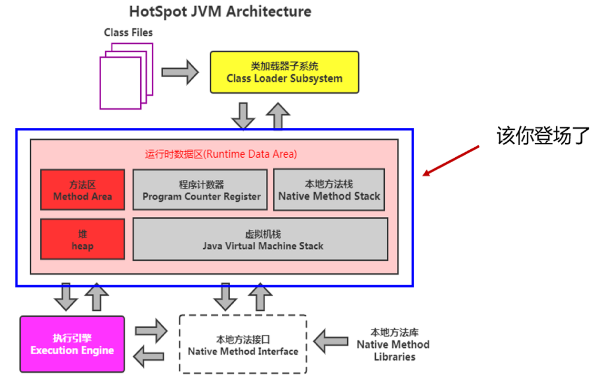
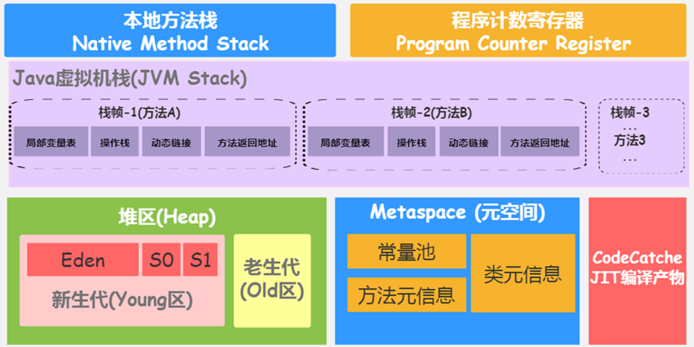
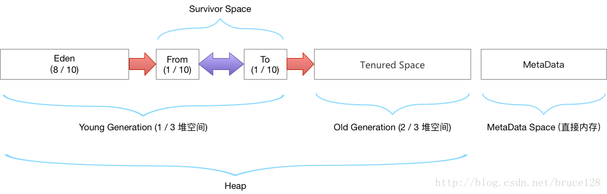

# 虚拟机运行时数据区域

## 运行时数据区域

​

​​​

### 程序计数器

> 通过改变这个计数器 的值来选取下一条需要执行的字节码指令

　　java 虚拟机的多线程是通过线程轮流切换、分配处理器执行时间的方式来实现的，在任何一个确定的时刻，一个处理器只会执行一条线程中的指令，为了线程切换后能恢复到正确的执行位置，每条线程都需要一个独立的程序计数器。
每个线程都会有属于自己独立的线程计数器，各线程之间计数器不会相互影响，独立存储，这些区域成为线程私有。

### Java虚拟机栈

> Java方法执行的线程内存模型

　　每个方法被执行，Java虚拟机栈会创建一个栈帧[(1)](https://www.yuque.com/pride_yang/blog/gngtxy)，用于存储局部变量表，操作数栈，方法出口，动态链接等信息。  
一个方法的执行对应着一个栈帧的入栈与出栈过程。

　　局部变量存储存放编译期间可知java虚拟机的基础类型（boolean，byte，char、short、int、float、dubbo、long）、对象引用（reference类型）、和returnAddress类型（指向一条字节码指令的地址）。

　　局部变量表的存储单位是局部**变量槽（slot）**  其中64位长度的long和 double类型的数据会占用两个变量槽，其余的数据类型只占用一个 （一个变量槽的内存占用空间由虚拟机自行决定） 。

　　当进入一个方法后，栈帧中需要分配多大的局部变量空间已经固定（变量槽数量）  
《Java虚拟机规范》中  规定如果线程请求的栈深度大于虚拟机所允许的深度，将抛出StackOverflowError异常，当栈扩展时无法申请到足够的内存会抛出OutOfMemoryError异常。  

### 本地方法栈

> 为虚拟机使用到的 Native 方法服务 （一个 Native Method 就是一个 java 调用非 java 代码的接口）

　　**HotSpot栈内存不允许动态扩容**

```bash
-Xss 设置栈容量 jdk11 windows最小值 180k Linux最小值228k 否则启动时会出现提示
```

### Java堆

> 被所有线程共享，在虚拟机启动时创建，用于存放对象实例。

- java堆是垃圾收集器管理的内存区域，也被成为GC堆。G1收集器出现之前，垃圾收集器一般基于分代收集理论设计，但是之后出现了一些不采用分代设计的垃圾收集器。所以收集器不一定存在新生代，老年代，永久代，Eden区，From Survivor区，To Survivor区等。
- 从内存角度看，所有线程共享的java堆可以划分为多个私有进程的分配缓存区（TLAB），以提升对象分配时的效率。

```bash
-Xmx 堆最大值
-Xms 堆最小值
-XX:+HeapDumpOnOutOfMemoryError 发生OOM时产生dump内存堆转储快照
-XX:HeapDumpPath=./ 设置快照文件保存位置
```

#### jvm堆的默认分配方案

　　
老年代 ： 三分之二的堆空间
年轻代 ： 三分之一的堆空间
eden区： 8/10 的年轻代空间
survivor0 : 1/10 的年轻代空间
survivor1 : 1/10 的年轻代空间（from 区）

　　**由于及时编译技术的进步，逃逸分析技术的日渐强大，栈上分配，标量替换等优化手段出现，对象实例也未必都全部分配在堆上。**

　　  
从 jdk 1.7 开始已经默认开启逃逸分析，如果某些方法中的对象引用没有被返回或者未被外面使用（也就是未逃逸出去），那么对象可以直接在栈上分配内存。

　　JDK8 后方法区（永生代）移除，用元空间代替，元空间使用直接内存

#### gc

##### MinorGC触发机制

* 当年轻代空间不足时，就会触发Minor GC。这里的年轻代满指的是Eden区满，Survivor满不会引发GC。（每次 Minor GC 会清理年轻代的内存。)
* 因为 Java 对象大多都具备朝生夕灭的特性，所以 Minor GC 非常频繁，一般回收速度也比较快。这一定义既清晰又易于理解。
* Minor GC会引发STW，暂停其它用户的线程，等垃圾回收结束，用户线程才恢复运行。

##### MajorGC触发机制

* 指发生在老年代的GC，对象从老年代消失时，我们说“Major GC”或“Full GC”发生了。

  * 出现了Major GC，经常会伴随至少一次的Minor GC（但非绝对的，在Parallel Scavenge收集器的收集策略里就有直接进行Major GC的策略选择过程）。
  * 也就是在老年代空间不足时，会先尝试触发Minor GC。如果之后空间还不足，则触发Major GC

* Major GC的速度一般会比Minor GC慢10倍以上，STW的时间更长。

* 如果Major GC 后，内存还不足，就报OOM了。

##### FullGC触发机制

* 调用System.gc()时，系统建议执行Full GC，但是不必然执行
* 老年代空间不足
* 方法区空间不足
* 通过Minor GC后进入老年代的平均大小大于老年代的可用内存
* 由Eden区、survivor space0（From Space）区向survivor space1（To Space）区复制时，对象大小大于To Space可用内存，则把该对象转存到老年代，且老年代的可用内存小于该对象大小

### 方法区（元空间）

> 主要用于存储被虚拟机加载的类型信息、常量、静态变量、及时编译器编译后的代码缓存等数据

#### 存储内容

* 类型信息
* 域信息

  * 域名称，域类型，域修饰符（public, private, protected, static, final, volatile, transient的某个子集）
* 方法信息

  * 方法名称
  * 方法的返回类型(或 void)
  * 方法参数的数量和类型(按顺序)
  * 方法的修饰符(public, private, protected, static, final, synchronized, native, abstract的一个子集)
  * 方法的字节码(bytecodes)、操作数栈、局部变量表及大小 （abstract和native方法除外）
  * 异常表（abstract和native方法除外）

    * 每个异常处理的开始位置、结束位置、代码处理在程序计数器中的偏移地址、被捕获的异常类的常量池索引
* non-final的类变量
* 运行时常量池

　　**在HotSpot中jdk1.8之前也被称为永久代 在jdk7后将永久代的功能转移到元空间**

　　**元空间默认初始大小20m**

```bash
-XX:MaxMetaspaceSize 设置元空间最大值，默认为-1 不受限制或者说收本地内存限制
-XX:MetaspaceSize 设置元空间初始空间大小 以字节为单位，达到该值会触发垃圾收集进行类型卸载，同事收集器会对该值进行调整，如果释放大量空间则适当降低该值，如果释放很少空间，那么在不超过最大值情况下适当提高。
-MinMetaspaceFreeRatio：在垃圾收集后控制最小的元空间剩余容量的百分比，可减少因元空间不足导致垃圾收集的频率
-MinMetaspaceFreeRatio：用于控制最大的元空间剩余容量的百分比
```

#### 运行时常量池

> 方法区的一部分，用于存放编译期产生的各种字面量和符号引用  
> **给基本类型变量赋值的方式就叫做字面量或者字面值**

　　**注： 字符串常量池在堆中**

### 直接内存(非本地内存)

```bash
-XX:MaxDirectMemorySize 设置字节内存大小 如果不进行设置则与java堆的最大值一致
```

##
