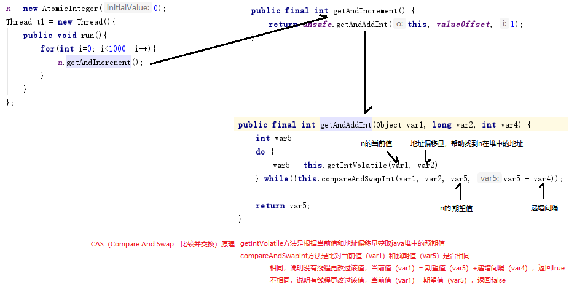
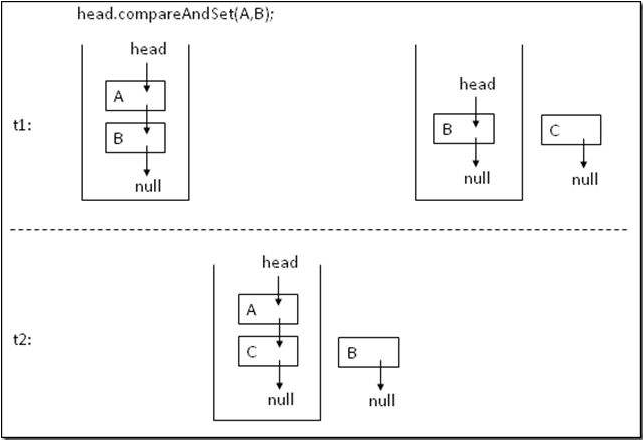

# 并发处理 

---

## 多线程特性

- 原子性
  - 一个或多个操作要么全部执行并且执行过程中不会被任何因素打断，要么就不执行。
- 可见性
  - 当多个线程同时访问一个变量时，一个线程修改了这个变量，其他线程能够立即看见修改的值。单线程不存在可见性问题。
- 有序型
  - 程序的执行按照代码的先后顺序执行

## 对象的发布和逸出

### 发布

> "发布( Publish)"一个对象的意思是指,使对象能够在当前作用域之外的代码中使用

1. 一个指向该对象的引用保存到其他代码可以访问的地方

```java
public class Person(){
    private String name;
    private int age;
}

public class Record{
    Person p;
}

```

2. 在某一个非私有的方法中返回该引用

```java
public class Person(){
    private String name;
    private int age;

    public Person get(){
        return new Person();
    }
}
```

3. 将引用传递到其他类的方法中

```java
public class Person(){
    private String name;
    private int age;
}

public class Record{
    private void getPersonMessage(Person p){
        .....
    }
}
```

### 逸出

> 当某个不应该发布的对象被发布时,这种情况就被称为逸出( Escape).

1. 内部的可变状态逸出

```java
class UnsafeStates{
    private String[] states = {"AK","AL",...};
    public String[] getStates(){
        return states;
    }
}
//数组states本事私有的变量，但是以public公有的方式发布出去，导致states已经逸出了它所在的作用域，任何调用者都能修改这个数组的内容
```

2. 隐式地使用this引用导致逸出

```java
public class ThisEscape{
    public ThisEscape(EventSource source){
        source.registerListener(
            new EventListener(){
                public void onEvent(Event e){
                    dosomething(e);
                }
            })
        //在这里count初始化为1
        count = 1;
    }
}
//当ThisEscape发布EventListener时，也隐含地发布了ThisEscape实例本身。因为在这个内部类的实例中包含了对ThisEscape实例的隐含引用。
//this逸出会导致ThisEscape也发布出去，也就是ThisEscape还没有构建完成就发布出去，也就是count=1;这一句还没执行就发布了ThisEscape对象，如果要使用count时,很有可能会出现对象不一致的状态
```

　　**使用工厂方法来防止this引用在构造函数过程中逸出**

```java
public class SafeListener{
    private final EventListener listener;
    private SafeListener(){
        listener = new EventListener(){
            public void onEvent(Event e){
                dosomething(e);
            }
        };
    }
    public static SafeListener newInstance(EventSource source){
        SafeListener safe = new SafeListener();
        source.registerListener(safe.listener);
        return safe;
    }
}
//保证在对象为构造完成之前，是不会发布该对象
```

## 线程封闭

1. Ad-hoc线程封闭。

> 维护线程封闭性的职责完全由程序实现承担，可用性不高。

　　Ad-hoc 线程封闭下的一个特例适用于 volatile 变量。 只要确保 volatile 变量仅从单个线程写入，就可以安全地对共享 volatile 变量执读 - 改 - 写操作。

2. 栈封闭。

　　局部变量，无并发问题，在项目中使用最多，简单说就是局部变量，方法的变量都拷贝到线程的堆栈中，只有这个线程能访问到。尽量少使用全局变量（变量不是常量）

3. ThreadLocal类。

## 原子类

　　Java 的 java.util.concurrent.atomic 包里面提供了很多可以进行原子操作的类，分为以下四类：

- 原子更新基本类型：AtomicInteger、AtomicBoolean、AtomicLong
- 原子更新数组：AtomicIntegerArray、AtomicLongArray
- 原子更新引用：AtomicReference、AtomicStampedReference 等
- 原子更新属性：AtomicIntegerFieldUpdater、AtomicLongFieldUpdater

　　提供这些原子类的目的就是为了解决基本类型操作的非原子性导致在多线程并发情况下引发的问题。

### 非原子问题演示

　　i++并不是原子操作

```java
import java.util.concurrent.atomic.AtomicInteger;

public class AtomicClass {
    static int n = 0;
    public static void main(String[] args) throws InterruptedException {
        int j = 0;
        while(j<100){
            n = 0;
            Thread t1 = new Thread(){
                public void run(){
                    for(int i=0; i<1000; i++){
                        n++;
                    }
                }
            };
            Thread t2 = new Thread(){
                public void run(){
                    for(int i=0; i<1000; i++){
                        n++;
                    }
                }
            };
            t1.start();
            t2.start();
            t1.join();
            t2.join();
            System.out.println("n的最终值是："+n);
            j++;
        }

    }
}
```

　　结果不一定全是 2000

### 非原子问题的原子解决

```java
import java.util.concurrent.atomic.AtomicInteger;

public class AtomicClass {
    static AtomicInteger n;
    public static void main(String[] args) throws InterruptedException {
        int j = 0;
        while(j<100){
            n = new AtomicInteger(0);
            Thread t1 = new Thread(){
                public void run(){
                    for(int i=0; i<1000; i++){
                        n.getAndIncrement();
                    }
                }
            };
            Thread t2 = new Thread(){
                public void run(){
                    for(int i=0; i<1000; i++){
                        n.getAndIncrement();
                    }
                }
            };
            t1.start();
            t2.start();
            t1.join();
            t2.join();
            System.out.println("n的最终值是："+n);
            j++;
        }

    }
}
```

　　**原理**



### CAS 的 ABA 问题

　　当前内存的值一开始是 A，被另外一个线程先改为 B 然后再改为 A，那么当前线程访问的时候发现是 A，则认为它没有被其他线程访问过。在某些场景下这样是存在错误风险的。如下图：



### AtomicStampedReference 解决 ABA 问题

```
AtomicStampedReference(初始值，时间戳)：构造函数设置初始值和时间戳
getStamp：获取时间戳
getReference：获取预期值
compareAndSet(预期值，更新值，预期时间戳，更新时间戳)：实现CAS时间戳和预期值对比
```

```java
import java.util.concurrent.atomic.AtomicInteger;
import java.util.concurrent.atomic.AtomicStampedReference;

public class AtomicClass {
    static AtomicStampedReference<Integer> n;
    public static void main(String[] args) throws InterruptedException {
        int j = 0;
        while(j<100){
            n = new AtomicStampedReference<Integer>(0,0);
            Thread t1 = new Thread(){
                public void run(){
                    for(int i=0; i<1000; i++){
                        int stamp;
                        Integer reference;
                        do{
                            stamp = n.getStamp();
                            reference = n.getReference();
                        } while(!n.compareAndSet(reference, reference+1, stamp, stamp+1));
                    }
                }
            };
            Thread t2 = new Thread(){
                public void run(){
                    for(int i=0; i<1000; i++){
                        int stamp;
                        Integer reference;
                        do{
                            stamp = n.getStamp();
                            reference = n.getReference();

                        } while(!n.compareAndSet(reference, reference+1, stamp, stamp+1));
                    }
                }
            };
            t1.start();
            t2.start();
            t1.join();
            t2.join();
            System.out.println("n的最终值是："+n.getReference());
            j++;
        }

    }
}
```

　　**注意：采用 AtomicStampedReference 会降低性能，慎用。**

　　‍
