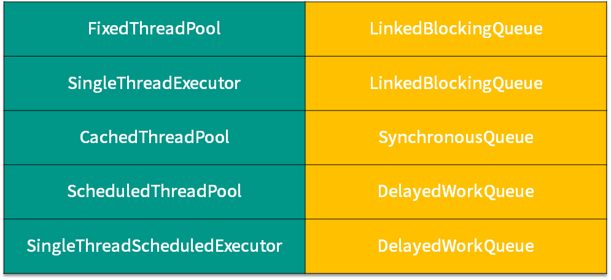

# 线程池 

## 线程池

1. Executor 接口：
   声明了 execute(Runnable runnable)方法，执行任务代码
2. ExecutorService 接口：
   继承 Executor 接口，声明方法：submit、invokeAll、invokeAny 以及 shutDown 等
3. AbstractExecutorService 抽象类：
   实现 ExecutorService 接口，基本实现 ExecutorService 中声明的所有方法
4. ScheduledExecutorService 接口：
   继承 ExecutorService 接口，声明定时执行任务方法
5. ThreadPoolExecutor 类：
   继承类 AbstractExecutorService，实现 execute、submit、shutdown、shutdownNow 方法
6. ScheduledThreadPoolExecutor 类：
   继承 ThreadPoolExecutor 类，实现 ScheduledExecutorService 接口并实现其中的方法
7. Executors 类：
   提供快速创建线程池的方法

## Executor 框架与线程池

　　Executor 框架包括：线程池，Executor，Executors，ExecutorService，CompletionService，Future，Callable 等

　　Executor 接口中之定义了一个方法 execute（Runnable command），该方法接收一个 Runable 实例，它用来执行一个任务

　　ExecutorService 接口继承自 Executor 接口，它提供了更丰富的实现多线程的方法，比如

1. submit()方法可以返回Future对象，可以调用isDone()方法查询Future是否已完成，当任务完成时，它具有一个结果，可以通过get()方法获取到该结果，Future提供了cancel()方法用来取消执行pending中的任务。
2. shutdown()方法允许之前已经提交的任务执行完毕之后再挂起关闭，shutdownNow()方法则阻止正在等待的任务启动，并尝试停止之前正在执行的任务。

　　**多线程的缺点：**

- 处理任务的线程创建和销毁都非常耗时并消耗资源。
- 多线程之间的切换也会非常耗时并消耗资源。
  **解决方法：采用线程池**
- 使用时线程已存在，消除了线程创建的时耗
- 通过设置线程数目，防止资源不足

### ThreadPoolExecutor 的全参构造函数参数

　　在 Java 中创建线程池常用的类是 ThreadPoolExecutor，该类的全参构造函数如下：

```java
public ThreadPoolExecutor(int corePoolSize,
                          int maximumPoolSize,
                          long keepAliveTime,
                          TimeUnit unit,
                          BlockingQueue<Runnable> workQueue,
                          ThreadFactory threadFactory,
                          RejectedExecutionHandler handler) {
```

　　参数介绍：

* ​`corePoolSize`​：线程池中核心线程数的最大值
* ​`maximumPoolSize`​：线程池中能拥有最多线程数
* ​`workQueue`​：用于缓存任务的阻塞队列，对于不同的应用场景我们可能会采取不同的排队策略，这就需要不同类型的阻塞队列，在线程池中常用的阻塞队列有以下 2 种：

  * ​`SynchronousQueue<Runnable>`​：此队列中不缓存任何一个任务。向线程池提交任务时，如果没有空闲线程来运行任务，则入列操作会阻塞。当有线程来获取任务时，出列操作会唤醒执行入列操作的线程。从这个特性来看，`SynchronousQueue`​ 是一个无界队列，因此当使用 `SynchronousQueue`​ 作为线程池的阻塞队列时，参数 `maximumPoolSizes`​ 没有任何作用。
  * ​`LinkedBlockingQueue<Runnable>`​：顾名思义是用链表实现的队列，可以是有界的，也可以是无界的，但在 `Executors`​ 中默认使用无界的。
* ​`keepAliveTime`​：表示空闲线程的存活时间。
* ​`unit`​：表示 `keepAliveTime`​ 的单位。
* ​`handler`​：表示当 `workQueue`​ 已满，且池中的线程数达到 `maximumPoolSize`​ 时，线程池拒绝添加新任务时采取的策略。一般可以采取以下四种取值。

  1. 如果没有空闲的线程执行该任务且当前运行的线程数少于 `corePoolSize`​，则添加新的线程执行该任务。
  2. 如果没有空闲的线程执行该任务且当前的线程数等于 `corePoolSize`​ 同时**阻塞队列未满**，则将任务入队列，而不添加新的线程。
  3. 如果没有空闲的线程执行该任务且阻塞队列已满同时池中的线程数小于 `maximumPoolSize`​，则创建新的线程执行任务。
  4. 如果没有空闲的线程执行该任务且阻塞队列已满同时池中的线程数等于 `maximumPoolSize`​，则根据构造函数中的 `handler`​ 指定的拒绝策略来拒绝新的任务。
* ​`threadFactory`​：指定创建线程的工厂

### 四种线程池拒绝策略

#### `ThreadPoolExecutor.AbortPolicy()`​

　　抛出 `RejectedExecutionException`​

#### `ThreadPoolExecutor.CallerRunsPolicy()`​

　　由向线程池提交任务的线程来执行该任务

#### `ThreadPoolExecutor.DiscardOldestPolicy()`​

　　抛弃最旧的任务（最先提交而没有得到执行的任务）

#### `ThreadPoolExecutor.DiscardPolicy()`​

　　抛弃当前的任务

### 阻塞队列

* ​`ArrayBlockingQueue`​：基于数组的阻塞队列实现，在ArrayBlockingQueue内部，维护了一个定长的数组，以便缓存队列中的数据对象，其内部没实现读写分离，也就意味着生产和消费者不能完全并行。长度是需要定义的，可以指定先进先出或者先进后出，因为长度是需要定义的，所以也叫有界队列，在很多场合非常适合使用。
* ​`LinkedBlockingQueue`​：基于链表的阻塞队列，同ArrayBlockingQueue类似，其内部也维持着一个数据缓冲队列（该队列由一个链表构成），LinkedBlockingQueue之所以能够高效地处理并发数据，是因为其内部实现采用分离锁（读写分离两个锁），从而实现生产者和消费者操作完全并行运行。需要注意一下，它是一个无界队列。
* ​`SynchronousQueue`​：一种没有缓冲的队列，生产者产生的数据直接会被消费者获取并且立刻消费。
* ​`PriorityBlockingQueue`​：基于优先级别的阻塞队列（优先级的判断通过构造函数传入的Compator对象来决定，也就是说传入队列的对象必须实现Comparable接口），在实现PriorityBlockingQueue时，内部控制线程同步的锁采用的是公平锁，需要注意的是它也是一个无界的队列。
* ​`DelayQueue`​：带有延迟时间的Queue，其中的元素只有当其指定的延迟时间到了，才能够从队列中获取到该元素。DelayQueue中的元素必须先实现Delayed接口，DelayQueue是一个没有大小限制的队列，应用场景很多，比如对缓存超时的数据进行移除、任务超时处理、空闲连接的关闭等等

​​

### 四种常用线程池（ExecutorService的实现类）

　　ThreadPoolExecutor 构造函数的参数很多，使用起来很麻烦，为了方便的创建线程池，JavaSE 中又定义了 Executors 类，Eexcutors 类提供了四个创建线程池的方法，分别如下

#### newCachedThreadPool

　　该方法创建一个可缓存线程池，如果线程池长度超过处理需要，可灵活回收空闲线程，若无可回收，则新建线程。
此类型线程池特点是：

1. .工作线程的创建数量几乎没有限制(其实也有限制的,数目为 Interger. MAX_VALUE)
2. 空闲的工作线程会自动销毁，有新任务会重新创建
3. 在使用 CachedThreadPool 时，一定要注意控制任务的数量，否则，由于大量线程同时运行，很有会造成系统瘫痪。

#### newFixedThreadPool

　　该方法创建一个指定工作线程数量的线程池。每当提交一个任务就创建一个工作线程，如果工作线程数量达到线程池初始的最大数，则将提交的任务存入到池队列中。
优点：具有线程池提高程序效率和节省创建线程时所耗的开销。
缺点：在线程池空闲时，即线程池中没有可运行任务时，它不会释放工作线程，还会占用一定的系统资源。

#### newSingleThreadExecutor

　　该方法创建一个单线程化的 Executor，即只创建唯一的工作者线程来执行任务，它只会用唯一的工作线程来执行任务，保证所有任务按照指定顺序(FIFO, LIFO,优先级)执行。如果这个线程异常结束，会有另一个取代它，保证顺序执行。
单工作线程最大的特点是可保证顺序地执行各个任务，并且在任意给定的时间不会有多个线程是活动的。

#### newScheduleThreadPool

　　该方法创建一个定长的线程池，而且支持定时的以及周期性的任务执行，支持定时及周期性任务执行。

> FixedThreadPool、SingleThreadPool：使用的是无界队列（LinkedBlockingQueue），当任务堆积很多时，会占用大量内存，最终导致OOM。ChachedTheadPool：可以无限创建线程（Integer.MAX_VALUE），任务过多时会导致创建线程达到操作系统上线或者发生OOM。ScheduledThreadPool、SingleThreadScheduledPool：使用的是DelayedWorkQueue队列，实质上也是一种无界队列，会导致OOM。

## 问题

### 为什么java的线程池当核心线程满了以后,先往blockingQueue中存任务,queue满了以后

　　起到一个缓冲的作用。最大线程数这个参数更像是无奈之举，在最坏的情况下做最后的努力，去新建线程去帮助消化任务。但是这种情况可能存在丢任务的情况。
